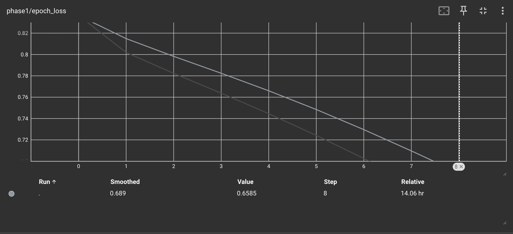
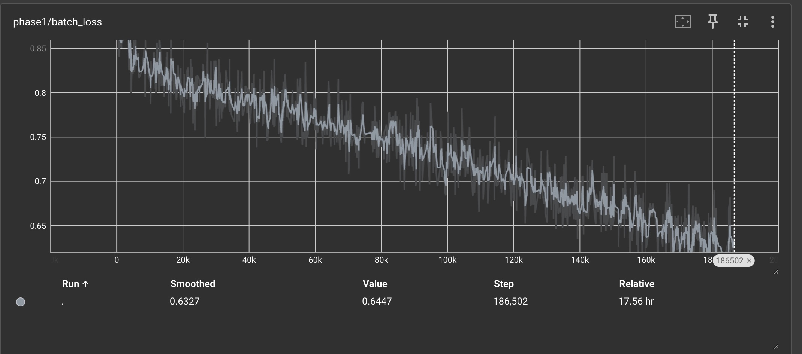
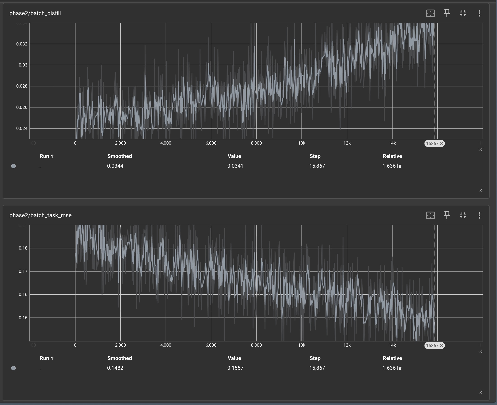
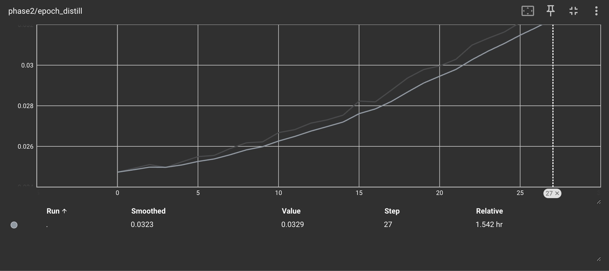
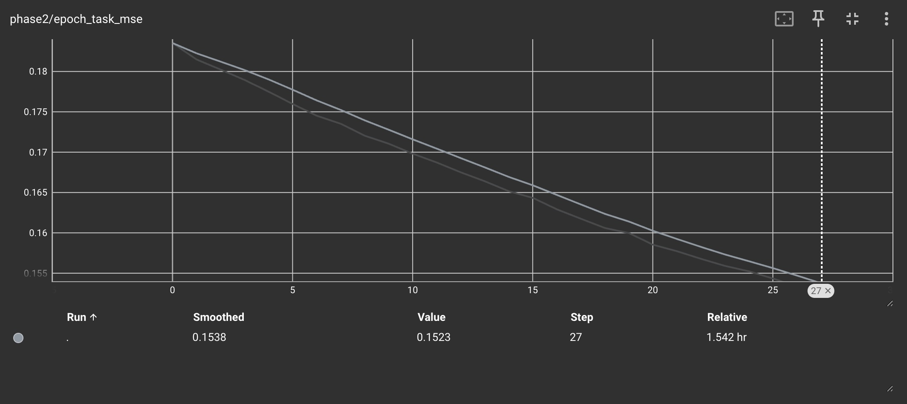

# GptForChess

**A Transformer-Based Chess Engine: From Reward-Driven Minimax to Cross-Attention Policy Networks**

Repository: <https://github.com/roshanbellary/GptForChess>

---

## Abstract

GptForChess is a multi-experiment investigation into building a competitive chess
engine using transformer architectures. The project evolved from a single
reward model paired with minimax search into a dual-model system: a **policy
model** that learns to predict moves directly, and a **reward model** that
provides a positional evaluation for the GUI's eval bar. Over six experiments,
the architecture progressed from a vanilla
transformer encoder evaluating move sequences, through puzzle-augmented
training, to the current Experiment 6 design, a CNN that produces 64
per-square board feature vectors, cross-attended by a stack of transformer
blocks that consume the move history. The current training run targets ~20
epochs at roughly 2 hours per epoch on a rented H100 / RTX PRO 6000 Blackwell,
for a **total training budget of approximately 40 hours**.

This document is the consolidated project report. Each experiment also has its
own analysis writeup in `experiments/experiment_N/analysis.md` under the repository.

---

## 1. Project Overview

### Goal

Train a transformer to play chess at a level competitive with high-Elo
amateur (~1800+) Lichess players, using only supervised learning on:

- Real human game records (Lichess open game database)
- Stockfish-labeled positions (for reward model training)
- High-quality Lichess puzzles (for tactical sharpness)

No reinforcement learning, no self-play, no MCTS — the goal was to see how
far a purely-supervised transformer can be pushed on chess.

### Why transformers

The motivating intuition: a chess game is a sequence of tokens (moves) over a
finite vocabulary (the ~1968 possible UCI moves). If transformers can model
language by predicting next-token distributions over move history, they
should also be able to model chess by predicting the next move. The position
state is *implicit* in the move history, replaying the moves from a known
starting position reproduces it. Whether the model has to learn this state
implicitly (through self-attention over a long move history) or get it
explicitly (through a CNN encoding the board) is one of the central
architectural questions this project explored.

---

## 2. Architecture Evolution

The architecture went through four major iterations across the six
experiments. Each version was driven by a specific limitation observed in
the previous one.

### V1: Reward-only with minimax (Experiments 1–3)

The original architecture was a single transformer encoder that took a move
sequence and produced a scalar reward in `[-1, 1]`, trained on Stockfish
centipawn evaluations normalized as `tanh(cp / 400)`. To actually play, the
reward model was wrapped in a minimax search with top-N move pruning at each
ply: at every game position, all legal moves were generated, the reward
model scored the resulting positions, the top N candidates were kept, and
recursion proceeded to the configured depth.

```
                      ┌─────────────────────────┐
                      │  Move history (tokens)  │
                      └────────────┬────────────┘
                                   │
                                   ▼
                      ┌─────────────────────────┐
                      │  Transformer Encoder    │
                      │  (8 layers, d=768)      │
                      └────────────┬────────────┘
                                   │
                              [CLS hidden]
                                   │
                                   ▼
                      ┌─────────────────────────┐
                      │   Linear → tanh         │
                      └────────────┬────────────┘
                                   │
                                   ▼
                           reward ∈ [-1, 1]


                       MINIMAX SEARCH (depth 3, top-N=5)
                                   │
                                   ▼
                              best move
```

**Limitation:** the reward model alone has no notion of "which move to
*play*" as it only evaluates positions. Every decision required searching
over all legal moves, scoring each resulting position, recursing. This was
expensive (legal_moves × reward_model_calls per ply) and the search depth
was capped at 3 in practice, leaving the engine vulnerable to longer-horizon
tactics. The reward model was also noisy enough that minimax frequently
selected moves on small reward differences that were within noise, and it was also erroneous enough to misevaluate blunders and winning positions.

### V2: Policy + Reward split (Experiment 4)

The pivot in Experiment 4: train a **separate policy model** that directly
predicts `P(next_move | move_history)`, freeing the engine from the
reward-driven minimax search. The reward model is kept for evaluation/UI
purposes (the eval bar in the demo) but no longer drives play. At inference
the policy model produces a distribution over the 1968 UCI moves, masks
to legal moves, and argmax-selects.

```
                  ┌──── Move history ────────────┐
                  │                              │
                  ▼                              ▼
       ┌─────────────────────┐         ┌─────────────────────┐
       │  Reward Model       │         │  Policy Model       │
       │  (transformer enc.) │         │  (transformer dec.) │
       └──────────┬──────────┘         └──────────┬──────────┘
                  ▼                                ▼
            reward [-1,1]                P(next_move | history)
                  │                                │
            (UI eval bar only)              argmax over legal moves
                                                   │
                                                   ▼
                                                AI's move
```

**Why this matters:** policy networks learn the human move directly
from supervision, which collapses an expensive search into a single forward
pass. They also encode positional understanding implicitly through the
self-attention over move history, learning patterns like "when castling is
available and king-side is weak, play O-O-O" without having to score every
sub-tree of move options.

This is also closer in spirit to Deepmind's policy network trained in the paper *Grandmaster-Level Chess Without Search*, but trained
purely on human games rather than self-play.

### V3: CNN board encoder, pooled (Experiment 5)

Experiment 4's policy model worked on games but failed catastrophically when
fine-tuned on puzzles. The root cause: puzzles are defined by a FEN
position, and the model had no way to *see* that position as it only saw
move tokens. This was a mistake on my part while building the data loader for the model. The architectural fix in Experiment 5 was to add a small CNN
that takes a board planes tensor `(19, 8, 8)` built from the setup board state given for the puzzle or the intial game state and produces a single
`d_model`-dim board summary, then injected at position 0 of the move
sequence (replacing the `[CLS]` token).

```
   Move history                    Board planes (19, 8, 8)
        │                                  │
        │                                  ▼
        │                       ┌────────────────────┐
        │                       │  BoardCNN          │
        │                       │  6× ResBlocks      │
        │                       │  → AdaptiveAvgPool │
        │                       │  → Linear          │
        │                       └──────────┬─────────┘
        │                                  │
        │                            (B, d_model)
        │                                  │
        ▼                                  │
   Token embeddings ──── replace pos 0 ◄───┘
        │
        ▼
   ┌──────────────────────────┐
   │  Transformer Encoder     │
   │  (self-attn only)        │
   └────────────┬─────────────┘
                ▼
           Linear head
                ▼
       P(next_move | history, board_at_start)
```

**Limitation:** the CNN pooled the entire board down to a single 768-dim
vector before any move ever queried it. This is an explicit information
bottleneck as the CNN had to commit to *one* summary of the board before
knowing what part of the position the policy was reasoning about. The
board signal was also frozen to the *starting* board of each sequence,
making it constant for game data (every game starts from the standard
opening) and stale for puzzles (the puzzle's FEN, frozen at position 0,
ignoring the moves that had been played onto it).

### V4: CNN per-square + cross-attention + live boards (Experiment 6)

The current architecture removes both V3 limitations. The CNN no longer
pools as it produces 64 per-square vectors of dimension `d_model`, each with
a learned positional embedding. The board planes are recomputed at *every*
position in the move sequence (a "live" board), so position `t` sees the
board state after moves `1..t` have been played, not just the starting
board. Move tokens cross-attend to this per-position board bank inside each
transformer block, gated by a Flamingo-style learnable scalar initialized
to zero so cross-attention is *disabled at the start of training* and the
model must earn each unit of board signal by reducing loss. This learnable scalar ensures that the cross attention from the live board does not provide too much attention to the token embeddings overpowering the signal from previous moves.

```
  Move history                       Per-position planes (T, 19, 8, 8)
       │                                          │
       │                                          ▼
       │                          ┌────────────────────────────┐
       │                          │  BoardCNN (no pool)        │
       │                          │  + learned square_pos      │
       │                          │  → (T, 64, d_model)        │
       │                          └─────────────┬──────────────┘
       │                                        │
       ▼                                        │
  token embeddings                       K, V banks (per position)
       │                                        │
       ▼                                        │
  ┌─────────────────────────────────────────────┴─────────────┐
  │              CrossAttnBlock  ×  8                         │
  │  ┌──────────────────────────────────────────────────────┐ │
  │  │  Self-attention over moves (causal mask)             │ │
  │  │            ▼                                         │ │
  │  │  Cross-attention: moves Q vs per-position board K,V  │ │
  │  │            × tanh(cross_gate)  ← init to 0           │ │
  │  │            ▼                                         │ │
  │  │  Feed-forward network                                │ │
  │  └──────────────────────────────────────────────────────┘ │
  └────────────────────────────┬──────────────────────────────┘
                               ▼
                          LayerNorm
                               ▼
                          Linear head
                               ▼
              P(next_move | history, live_board_at_t)
```

**Key invariants:**

- **Leak-safety is structural.** Each move query at position `t` is paired
  with exactly its own 64-square K/V bank (via `reshape(B*T, 64, d)`).
  Position `t` cannot attend to position `t+1`'s board because that
  board is never even materialized into position `t`'s attention matrix.
- **Live board.** `plane[t]` reflects state *after* tokens `[1..t]` have
  been played. The move being predicted (`token[t+1]`) is not in
  `plane[t]`, so multi-position language-modeling supervision remains
  honest.
- **Information capacity.** Board representation went from 768 dims (V3)
  to 49,152 dims (V4) as 64 × 768. No forced compression.

---

## 3. Data Inputs

Three data sources, all curated from public datasets and persisted as
memory-mapped binary files for fast training I/O.

### 3.1 Lichess game database

- **Source:** Lichess open game database, streamed from HuggingFace
  (`Lichess/standard-chess-games`).
- **Filter:** both players Elo ≥ 1800, `Termination == Normal`.
- **Volume:** ~1 million games for policy training, ~1 million for reward
  training (disjoint subsets).
- **Tokenization:** each game's `movetext` is parsed via SAN → UCI, then
  mapped through a fixed tokenizer covering all 1968 possible UCI moves +
  special tokens (`[CLS]`, `[PAD]`).
- **Sequence length:** capped at 128 tokens (~64 plies = 64 plies of
  history, which covers all but the longest games in the filtered set).

### 3.2 Stockfish-labeled positions (reward model)

- **Source:** positions sampled from the reward-game subset, each labeled
  with `tanh(centipawns / 400)` from a depth-12 Stockfish evaluation.
- **Sampling:** ~20 positions per game, weighted toward mid/late game
  (`skew_exponent=1.5`) to avoid over-representing standard openings.
- **Volume:** ~10 million labeled positions.
- **Storage:** memory-mapped `.bin` files (int32 tokens, float32 labels,
  int32 lengths) for zero-copy DataLoader access.

### 3.3 Lichess puzzles (Experiments 4–6)

- **Source:** `Lichess/chess-puzzles` from HuggingFace.
- **Filter:** `Popularity ≥ 75` and `NbPlays ≥ 5000` for quality.
- **Volume:** ~376K training puzzles + 100K held-out test puzzles
  (Experiment 6).
- **Layout:** each puzzle stored as `[CLS, setup_move, solver_1, opp_1,
  solver_2, ...]` plus the puzzle's starting FEN (used to construct the
  per-position planes in Experiment 6).

### 3.4 Held-out test sets

All three train sets have a fixed-seed (42) held-out test split saved as
`{name}_test_indices.npy`. The training dataset loader reads this file
and excludes those indices, ensuring train/test are disjoint even though
they share the underlying `.bin` files.

---

## 4. Experiment Timeline

### Experiment 1 — Initial reward model

- 20M filtered Lichess games, two-phase training: Phase 1 on outcome labels
  (win/loss/draw), Phase 2 on Stockfish labels with a distill weight to ensure that model still retained knowledge from Phase 1
- Phase 1 loss was extremely noisy due to Bayes error in win/loss labels
  (many positions look equal but resolve to a winner).
- Phase 2 saw steady improvement on Stockfish task but the model gave
  inaccurate evaluations in the opening, where most of the position-noise
  lives.
- Notable bug: tokenizer was built from move corpus, so some rare moves
  weren't covered and caused the inference engine to crash.




### Experiment 2 — Reduced distillation factor

- Dropped distill weight to `λ = 0.01`, more epochs on Phase 2; Dropped weight as advantage coming from training on noisy labels is practically nonexistent with model gaining far better performance off of Stockfish labels
- Opening play improved noticeably; endgame was still terrible (model
  thought it had +0.9 winning odds while in checkmate-in-3).
- Conclusion: needed more endgame-rich training data and a more robust
  tokenizer. At the time, was using a SAN tokenizer meaning move space was 40k+. Realized that I could switch to FEN with a 1978 move space meaning far less parameters -> smaller model -> better performance due to not needing to consider such a large token set.





### Experiment 3 — Pure Stockfish training

- Dropped the outcome-label phase entirely. Trained from scratch on a
  500K-position Stockfish dataset, no distillation.
- Test MSE dropped to 0.08 (from Experiment 2's 0.15), a 50% improvement.
- Play quality improved across opening and endgame. Mid-game remained
  weakest because mid-game positions are the most diverse and the
  reward model had to make the hardest evaluative judgments there.
- Pivotal observation: even with a good reward model, *minimax driving
  play* was limited. Move selection was bottlenecked by the search depth
  the budget allowed and the inaccuracies of the reward model


### Experiment 4 — The Policy/Reward split + puzzles

- **Architectural pivot:** introduced a separate `ChessPolicyModel` that
  predicts `P(next_move | history)` directly. The reward model was kept
  for the demo's eval bar but no longer drives play.
- Two-phase Phase 2 training: Phase 2a on full games (~950K), Phase 2b
  fine-tunes on ~1.4M puzzles.
- **Phase 2a worked great**: test top-1 = **65.4%**, top-5 = **81.9%**,
  perplexity = 4.0 on the games-only test set.
- **Phase 2b broke things**: puzzle FEN context was thrown away during
  preprocessing (the FEN was only used to validate moves were legal, then
  discarded). The model fine-tuned on bare move sequences with no
  position context, and game performance collapsed:
  - Top-1: 65.4% → **51.3%** (−14.1 pp)
  - Perplexity: 4.0 → **19.81** (5× worse)
  - Puzzle first-move solve: 0.1% → only **3.6%**
- Built a formal benchmark system with three held-out test sets (reward,
  policy, puzzle) for reproducible evaluation.


The lesson: puzzles can't supervise a model that can't see the board they
came from. The architectural fix is a CNN that encodes the position into
the model's input stream.

### Experiment 5 — CNN board encoder + mixed game/puzzle training

- Added a `BoardCNN` (6 residual blocks at 128 channels with GroupNorm)
  that pools the board to a single `d_model`-dim vector, placed at
  position 0 of the move sequence (replacing `[CLS]`).
- Mixed-batch training: every batch is hard-balanced at 80% game + 20%
  puzzle samples (`MixedBatchSampler`), with a 5× per-sample loss weight
  on puzzle rows so they account for ~50% of the gradient norm despite
  being a quarter of samples.
- 12 epochs at batch size 1024 on RTX PRO 6000 Blackwell, ~2.3 hr.
- **Results:**
  - Game top-1: **64.0%** (essentially preserved vs Phase 2a baseline)
  - Puzzle first-move solve: **12.67%** (3.5× over Experiment 4)
  - Train/test loss gap: 0.85 vs 1.60 (0.75-nat overfit signature)
- The 3.5× jump in puzzle accuracy confirmed the CNN was doing its job.
  The train/test gap was the price of oversampling puzzles + the 5×
  weight: each puzzle was being seen ~13× over the run.


Two limitations identified for Experiment 6:
1. The CNN pooled to one vector which is an **information bottleneck**.
2. The board was static (frozen at position 0) giving a **staleness bottleneck** that became worse as the game progressed. This meant model was forced to learn how to evaluate board state from moves taken. We can do better than that

### Experiment 6 — Cross-attention + live boards (in progress)

Experiment 6 fixes both Experiment 5 limitations simultaneously:

- **`BoardCNN` no longer pools.** Output is `(B, T, 64, d_model)` — 64
  per-square vectors per board with a learned 64-element positional
  embedding.
- **New `CrossAttnBlock`** replaces `nn.TransformerEncoderLayer`. Each
  block does self-attention over moves → cross-attention (moves Q,
  board K/V) → FFN, all pre-norm + residual. Cross-attention is gated
  by a Flamingo-style learnable scalar initialized to zero.
- **Live board planes.** Each sample carries `(T, 19, 8, 8)` per-position
  planes where `plane[t] = state after tokens[1..t] have been played`.
  Built on the fly by replaying moves on a `chess.Board` in the dataloader
  — no extra disk storage required.
- **Information-leak-safe by construction.** Each query at position `t`
  is paired with its own per-position 64-square K/V bank. There is no
  shared K/V matrix across positions, so position `t` *cannot*
  structurally attend to position `t+1`'s board.

**Training configuration:**

| Hyperparameter | Value |
|---|---|
| Model: `d_model` | 768 |
| Model: `num_layers` | 8 |
| Model: `nhead` | 12 |
| Model: `dim_feedforward` | 3072 |
| CNN: channels | 128 |
| CNN: residual blocks | 6 |
| Policy data | 946K games (Elo ≥ 1800) |
| Puzzle data | 377K puzzles |
| Epochs | 20 |
| Batch size | 128 (per-position planes inflate memory ~190× vs Exp 5) |
| Learning rate | 3e-5 |
| Puzzle ratio (batch) | 0.2 |
| Puzzle loss weight | 5.0 |
| Num workers | 16 |

**Training cost.** The per-position CNN runs 128× more often per forward
pass than Experiment 5. On RTX PRO 6000 Blackwell, this gives ~2h 20m per
epoch × 20 epochs = **~40+ hours of total training**. The 12-epoch
Experiment 5 ran in 2.3 hours; Experiment 6's 40-hour budget reflects the
combined cost of (a) per-position CNN evaluation, (b) cross-attention
inside each transformer block, and (c) running 20 epochs instead of 12.

**Status at time of writing:** training in progress. Epoch 1 metrics
(policy_test loss = 1.27, top-1 = 66.2%, puzzle first_move = 22.1%) are
ahead of Experiment 5's 12-epoch baseline, but the `cross_gate` values
are still small (~0.03–0.10), suggesting the cross-attention pathway has
just started to open. The training run also logs per-block gate values to
TensorBoard each epoch, so the cross-attention engagement can be
monitored as it climbs.

Per-epoch policy model checkpoints (`policy_model_epoch_NN.pt`) are saved
for later evaluation across the training trajectory.

See `experiments/experiment_6/analysis.md` for the full procedure section
including architectural rationale, data pipeline details, memory analysis,
and code-change summary.

---

## 5. Results Summary

### Reward model (best: Experiment 3)

| Metric | Experiment 1 | Experiment 2 | Experiment 3 |
|---|---|---|---|
| Test MSE | 0.20+ | 0.15 | **0.08** |
| Train Phase 1 + 2 | yes | yes | no (single-phase) |
| Distillation | yes | reduced | none |

Experiment 3's single-phase Stockfish-only training, on a smaller but
better-targeted dataset, decisively beat the earlier two-phase approaches.

### Policy model

| Experiment | Top-1 (game test) | Top-5 (game test) | Puzzle first-move | Notes |
|---|---|---|---|---|
| Exp 4 Phase 2a | 65.4% | 81.9% | 0.1% | games only |
| Exp 4 Phase 2b | 51.3% | 61.8% | 3.6% | puzzle FT broke games |
| Exp 5 (CNN+mixed) | 64.0% | 79.5% | 12.67% | CNN pooled board, 12 ep |
| Exp 6 (in progress) | 66.2% (epoch 1) | 83.9% (epoch 1) | 22.1% (epoch 1) | live boards + cross-attn |

### Subjective play quality

- Experiment 3 (reward + minimax): decent opening and endgame, weak
  midgame.
- Experiment 4 Phase 2a (policy-only): strong opening and middlegame,
  blunders pieces in endgame.
- Experiment 5 (policy + CNN board): notable improvement over Exp 4 in
  reduced blunders and better tactical decisions.
- Experiment 6: too early to judge since training in progress and will take 40 hours to finish 😭

---

## 6. Repository Structure

```
src/
  tokenizer.py        Fixed UCI-vocab tokenizer (~1968 moves + specials)
  model.py            BoardCNN, CrossAttnBlock, ChessRewardModel,
                      ChessPolicyModel, Reward/PolicyModelInference
  build_datasets.py   Resumable 5-stage data pipeline (HF streaming →
                      Stockfish labeling → tokenization → memmaps)
  train.py            ChessPolicyDataset (with per-position plane replay),
                      MixedBatchSampler, training loop with cross-gate
                      logging and per-epoch checkpointing
  mcts.py             Minimax search (legacy; used in Experiments 1–3)
  benchmark.py        Standalone evaluation runner
demo.py               Pygame interactive demo to play vs the model
experiments/
  experiment_1..6/    Each contains analysis.md, training images,
                      and checkpoints
deployment.md         Vast.ai workflow: rent → build → train → fetch
```

### Key command reference(for Mac/ARM 64 systems specifically)

```bash
# Build datasets (Experiment 6 mode — no Stockfish, much faster)
poetry run python src/build_datasets.py --policy-only \
    --policy-games 1000000 \
    --min-puzzle-popularity 75 --min-puzzle-plays 5000

# Train policy model (Experiment 6 configuration)
PYTORCH_CUDA_ALLOC_CONF=expandable_segments:True \
PYTHONPATH=src python src/train.py \
    --skip-reward \
    --policy-epochs 20 --batch-size 128 \
    --learning-rate 3e-5 --num-workers 16 \
    --puzzle-loss-weight 5.0 --puzzle-ratio 0.2 \
    --log-dir runs/exp6

# Play against the model
arch -arm64 poetry run python demo.py \
    --policy-model {{path to policy model}} 
```

---

## 7. Discussion

### What worked

- **Splitting reward and policy** was the highest-leverage architectural
  decision. Minimax search over a noisy reward model is 
  bounded by the depth × branching factor cost and the limits on reward model performance; a learned policy
  collapses that into one forward pass and provides a much sharper
  move distribution.
- **Mixed game/puzzle batches with per-sample loss weighting** (Experiment
  5) successfully avoided the catastrophic forgetting that sequential
  puzzle fine-tuning produced in Experiment 4 although that was mainly due to properly considering the setup game state for puzzle training
- **CNN-conditioned policy training** was the unlock for puzzle data.
  Without it, the FEN context was metadata the model couldn't see;
  with it, puzzle accuracy jumped 3.5× in Experiment 5 and looks
  poised to jump further in Experiment 6.

### What didn't work (and what it taught)

- **Outcome labels (win/loss/draw) as a primary training signal** were
  too noisy. Bayes error dominated learnable signal. Stockfish labels
  were strictly better.
- **Puzzle fine-tuning without position context** (Experiment 4 Phase 2b)
  was actively harmful: it degraded game play while marginally helping
  puzzles, because the model had no way to ground the puzzle moves in
  a board state.
- **Pooling the board to a single vector** (Experiment 5) is an explicit
  information bottleneck. The CNN can't know in advance which part of
  the board the policy will need to reason about keeping the spatial
  structure intact and letting attention pull what it needs (Experiment
  6) is a better fit.

### Open questions for future experiments

- Do the cross-attention gates climb to meaningful values (≥0.3) by
  the end of Experiment 6, indicating the model genuinely uses the
  board pathway? Or do they stay near zero, meaning the move history
  is doing all the work? Also which ones turn negative per each layer?
- Does Experiment 6 close Experiment 5's train/test gap, or widen it
  further due to per-position memorization? The gap is the key signal
  for whether to lower puzzle loss weight in a hypothetical Experiment 7.
- Is the architecture data-bound or compute-bound? Experiment 4's
  reward model was capacity-bound (test MSE < train MSE → underfit).
  Whether the policy model is similarly underfit will determine
  whether scale (d_model = 1024+) or data (more puzzles, more games)
  is the next investment.

---

## 8. Acknowledgments and References

- **Lichess** for the open game and puzzle databases.
- **Stockfish** for the position-evaluation labels used to train the reward
  model.
- The **Grandmaster-Level Chess Without Search** paper (Ruoss et al., 2024) for the policy/value
  decomposition that motivated the Experiment 4 split.
- The **Flamingo** paper (Alayrac et al., 2022) for the gated cross-attention
  pattern used in Experiment 6's `CrossAttnBlock`.

---

*Last updated: May 2026. Training of Experiment 6 in progress; this document
will be revised with the final 20-epoch results once that run completes.*
