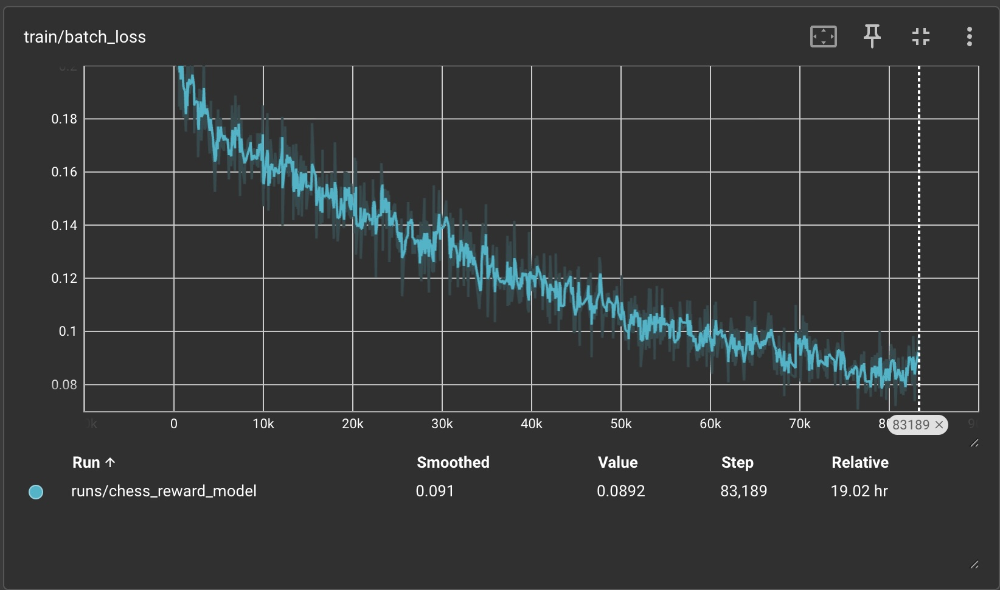
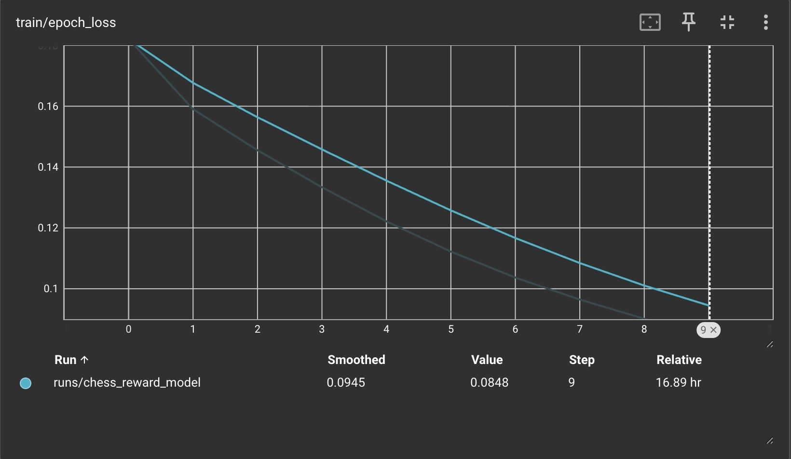

### Experiment 3

## Analysis

Hypothesis: Running training on a large well-built Stockfish dataset will lead to performance improvements of the reward model when using a minimax policy of depth 3

### Procedure of Experiment:

Spent 15 hours of compute locally building a 500k size Stockfish-labeled dataset on my Mac(8 cores each running stockfish). This dataset was then used to train a model from scratch purely on this data(in past experiments/iterations I trained model in two phases with phase 1 being on win/loss data while phase 2 was a smaller stockfish dataset).

Performance improvements were realized off of initial play with the model; as a task, I need to build out a test set in order to be able to evaluate performance overall. Based purely off of train set without the hampering of distill loss, the chess model was able to achieve 0.08 MSE which is better than the prior 0.15 MSE it achieved in experiment 2.

While playing with model, it had great start play with proper rewards attributed to start play, mediocre mid-game play and great end-game play. This makes sense as start games and end games occur more widely in the dataset while evaluation of mid-game suffers due to the how much generality there is

### Avenues for Improvement:

When it comes to improvements, I have 3 levers to pull: increase dataset size, increase model scale(currently 40M parameters), and improve dataset structure. For the first two, I can increase compute to draw in 5M Stockfish games and incrase model size and train on larger GPU. Second, I plan on following the AlphaGo chess paper far more closely. Model can draw better information when trained on larger diversity of game plays(it gets redundant when model gets trained on same starting game play and same end game play; in addition, beginner vs beginner gameplay tends to become monotonous in moves). If model wants to improve, then I need to incorporate more mid game play sampling from mid game 40% of the time, beginning play 30% of the time and end game play 30% of the time. I can also improve reward model to find better moves by focusing on high ELO difference games which should lend to wider ELO differences between players allowing model to learn when it's concretely losing.

