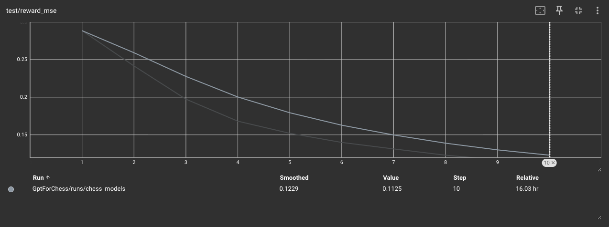
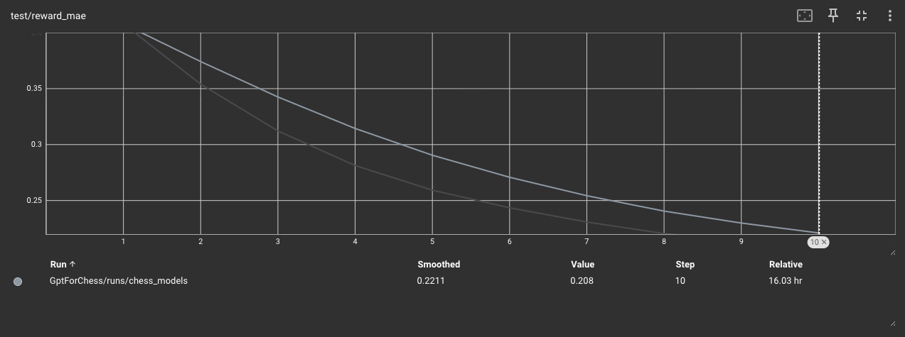
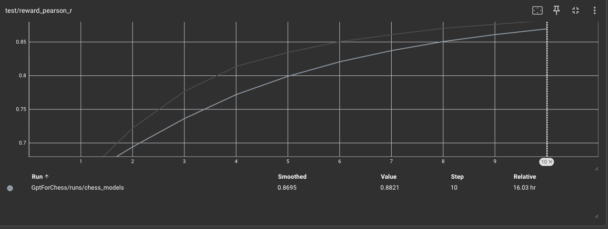
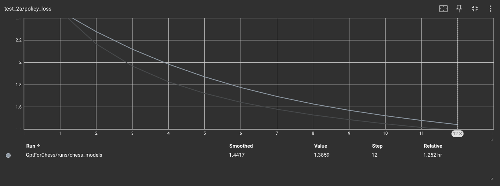
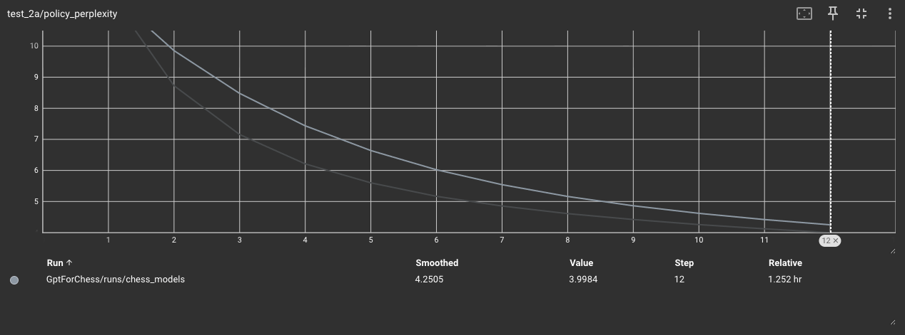
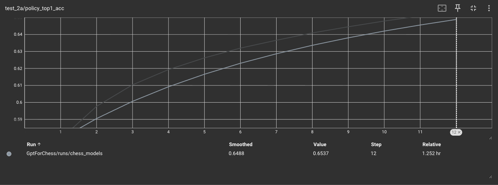
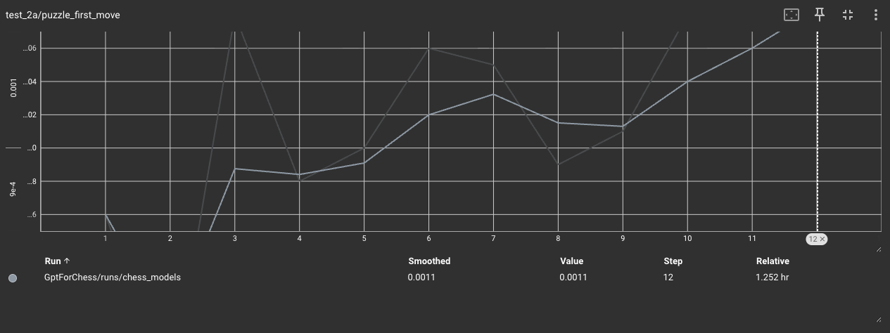
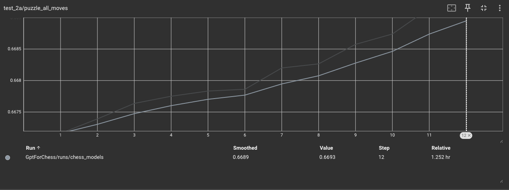
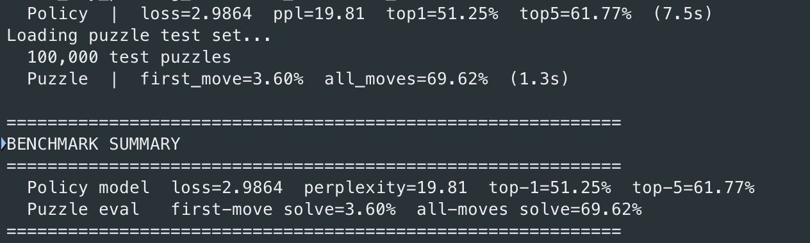

# Experiment 4: Puzzle-Augmented Policy Training + Systematic Benchmarking

## Hypothesis

Augmenting policy model training with ~1.5M high-quality Lichess chess puzzles will meaningfully improve tactical move accuracy specifically the puzzle first-move solve rate and top-1 next-move accuracy without degrading strategic/positional play learned from full games. Puzzle data provides uniquely clean supervision: every solver move is the "only" correct move, which is rare in standard game sequences where many moves are roughly equivalent. This hard labeling should sharpen the policy's confidence at critical decision points.

Secondary hypothesis: a formal held-out benchmark (rather than ad-hoc interactive play) will reveal where the model actually struggles, likely mid-game tactics, and give a repeatable metric to track across future experiments.

---

## Procedure

### 1. Policy data augmentation with chess puzzles

Added a Stage 5 pipeline to `build_datasets.py` that streams the Lichess/chess-puzzles dataset from HuggingFace (~4.99M entries). Each puzzle contains a FEN (position before opponent's setup move) and a Moves string (UCI solution sequence). Applied two quality filters to get a reliable signal:

- `Popularity >= 75` — removes poorly-rated or disputed puzzles
- `NbPlays >= 5000` — ensures enough attempts for popularity to be meaningful

These filters yield approximately **1.5M high-quality puzzles** from the full 4.99M.

#### Puzzle structure: setup move + solution

Each puzzle decomposes into two parts:

- **Setup move S**: the opponent's forcing move (`Moves[0]`) — applied to the FEN to reach the puzzle position. This is the position the player must respond to. We treat S as **context**, not a prediction target — the model is never asked to guess what the opponent did.
- **Move set / solution**: `Moves[1:]` — the alternating sequence of (solver move, forced opponent response, solver move, ...). Every solver move is the "only correct" move; this is the supervision signal we want.

Each puzzle is tokenized as:

```
[CLS, S, m1, opp1, m2, opp2, ...]
```

All moves are validated against a `chess.Board` initialized from the FEN — any illegal move discards the entire puzzle.

### 2. Fine-tuning objective: P[m_n | S, M_{<n}]

The puzzle phase fine-tunes the policy model to learn:

> Given the setup move S and prior moves M_{<n}, predict the next move m_n.

In other words, we model the conditional distribution P[m_n | S, M_{<n}], where S is fixed context and the loss accumulates only over the solution moves.

#### Training step (per puzzle batch)

For input sequence `x = [CLS, S, m1, opp1, m2, ...]`:

1. **Input** to the policy model: `x[:-1]` = `[CLS, S, m1, opp1, ...]`
2. **Targets** for cross-entropy: `x[1:]` = `[S, m1, opp1, m2, ...]`
3. **Mask the setup move from loss**: `targets[:, 0] = pad_id`. Cross-entropy is called with `ignore_index=pad_id`, so the model is **not** penalized for failing to predict S from `[CLS]` — that prediction would be ill-posed (S is the opponent's move, not a model decision).
4. All remaining target positions (m1, opp1, m2, ...) contribute to the loss. The model updates its weights to match the unique solver moves and the forced opponent responses.

This is implemented in `_run_epoch_policy_puzzle` in `src/train.py`. The non-puzzle policy epoch (`_run_epoch_policy`) is unchanged — it computes loss at every non-PAD position because in full games there is no "context-only" prefix.

#### Two-phase Phase 2 training

Rather than mixing puzzle and game sequences in the same batches (originally planned 50/50), training runs **sequentially**:

| Phase | Data | Epochs (default) | Loss | Function |
|---|---|---|---|---|
| **2a** | ~950K full game sequences | `--policy-epochs 15` | cross-entropy at every position | `_run_epoch_policy` |
| **2b** | ~1.4M puzzle sequences | `--puzzle-epochs 5` | cross-entropy with setup move masked | `_run_epoch_policy_puzzle` |

Phase 2a establishes broad positional play from full games. Phase 2b then fine-tunes the resulting weights on puzzle solutions — the model arrives at puzzle training already knowing how chess sequences work and learns to sharpen its move distribution toward the unique correct answer at each solver position. After Phase 2a `policy_model.pt` is saved, then Phase 2b overwrites it with the fine-tuned weights.

This sequential structure also makes ablation easy: skip `--puzzle-data` to get a games-only baseline, or run `benchmark.py` against the post-Phase-2a checkpoint before fine-tuning to measure the puzzle-induced delta.


### 3. Formal benchmark system

The main weakness identified in Experiment 3 was the absence of a systematic test set: performance was judged by ad-hoc play rather than reproducible metrics. This experiment addresses that directly.

Built three held-out test sets in `build_datasets.py`:

| Test Set | Size | Source | Purpose |
|---|---|---|---|
| `stockfish_test_*.bin` | 50K positions | Sampled from stockfish memmap (fixed seed 42) | Reward model MSE/MAE/Pearson r |
| `policy_test_*.bin` | 50K sequences | Sampled from policy memmap (fixed seed 42) | Policy loss, perplexity, top-1/top-5 accuracy |
| `puzzle_test_*.bin` | 100K puzzles | First 100K collected before training puzzles | Puzzle first-move solve rate |

All three test sets are **genuinely disjoint** from training:
- Puzzle test set: the streaming pipeline collects the first 100K quality-filtered puzzles as test, then continues to collect training puzzles.
- Reward and policy test sets: a fixed-seed (42) random sample of indices is drawn from the underlying memmap and saved to `{name}_test_indices.npy`. The training dataset loaders read these files and skip those indices, so the model never trains on positions/sequences that appear in the test set. The fixed seed guarantees the same indices are always evaluated across runs.

Metrics per test set:
- **Reward model**: MSE, MAE, Pearson r (predicted vs Stockfish eval)
- **Policy model**: cross-entropy loss, perplexity, top-1 accuracy, top-5 accuracy
- **Puzzle eval**: first-move solve rate (top-1 at the solver's key move), all-moves solve rate

These metrics are logged to TensorBoard after every epoch and are also available via the standalone `benchmark.py`:

```bash
arch -arm64 poetry run python src/benchmark.py \
    --reward-model reward_model.pt \
    --policy-model policy_model.pt \
    --data-dir data/
```

---

## Workflow

```bash
# 1. Build datasets + test sets (one-time)
python src/build_datasets.py \
    --min-puzzle-popularity 75 \
    --min-puzzle-plays 5000

# 2. Train: Phase 1 (reward) → Phase 2a (policy on games) → Phase 2b (puzzle fine-tune)
python src/train.py \
    --policy-epochs 12 \
    --puzzle-data data/ \
    --puzzle-epochs 5

# 3. Benchmark
python src/benchmark.py
```

---

## Results

### Reward Model

The reward model was trained at the larger architecture (d_model=768, 8 layers, dim_ff=3072, ~58M params) on ~17M Stockfish-labeled positions. Counterintuitively, **the absolute MSE/MAE values are higher than Experiment 3's smaller model** — at first glance this looks like a regression, but the more diagnostic finding is the relationship between train and test loss.

**Test MSE was consistently lower than train MSE across all 10 epochs.** That's the opposite of the usual pattern and is a clear signal that the model is **underfitting** rather than overfitting. The model has more capacity to use; the data isn't saturating it. This means the architecture can be pushed further (more parameters, more epochs, or more data) and we should expect performance gains rather than diminishing returns. Pearson r climbed steadily across epochs, confirming the model is still learning the Stockfish→position mapping rather than memorizing it.





**Takeaway**: capacity-bound, not data-bound. A future experiment can scale d_model from 768 → 1024 (the "Mid upscale" config evaluated earlier) with confidence the gains will materialize.

### Policy Model — Phase 2a (game sequences)

Phase 2a was unambiguously successful. Cross-entropy loss descended cleanly from ~6.0 (uniform-distribution baseline over 1968 UCI moves is ~7.6) down to **~1.5 by epoch 12**. Held-out test metrics at the end of Phase 2a:

| Metric | Phase 2a final |
|---|---|
| Test loss | 1.386 |
| Test perplexity | 4.00 |
| Test top-1 accuracy | **65.4%** |
| Test top-5 accuracy | **81.9%** |

A perplexity of 4.0 on the policy model means at every position in a held-out game, the model's distribution is as concentrated as if it were uniformly choosing among only ~4 moves out of 1968 possible. Top-1 of 65% means in roughly two-thirds of positions, the model's single best guess matches the move actually played by an 1800+ Elo player — that's strong for this scale.





This Phase 2a checkpoint (`policy_model_phase2a.pt`) is the strong baseline going forward. The training loop now saves it explicitly so it survives Phase 2b regardless of what happens.

### Policy Model — Phase 2b (puzzle fine-tuning, what went wrong)

Phase 2b was where the experiment broke down, and the root cause was a misunderstanding of the puzzle data format.

I had assumed the `FEN` field in each Lichess puzzle could be treated as a sequence of setup moves — i.e., that the FEN was equivalent to "play this sequence of moves from the starting position to reach the puzzle." Under that assumption, the natural integration was: tokenize the FEN-implied move history alongside the puzzle solution moves, feed everything into the existing transformer, and let the model learn from the combined sequence.

That assumption was wrong. **A FEN is a snapshot of board state at one moment**, not a recipe for getting there. It encodes piece positions, side-to-move, castling rights, and en passant availability — but no information about the move sequence that produced the position. There may be many move sequences that lead to the same FEN, and the FEN itself can't be reconstructed from a sequence of moves without replaying them.

The consequence in the data pipeline (`_process_puzzle()` in `src/build_datasets.py`): the FEN was used only to *validate* that puzzle moves were legal during dataset construction, then **thrown away**. The token sequence saved to `puzzle_*.bin` contained only `[CLS, S, m1, opp1, m2, ...]` — the puzzle's local move sequence with no representation of the underlying position. The model was being fine-tuned on bare move sequences torn out of context, with no way to know what board state those moves were responding to.

The benchmark numbers reflect the damage:

| Metric | After Phase 2a | After Phase 2b | Δ |
|---|---|---|---|
| Policy loss | 1.386 | 2.986 | +1.6 (much worse) |
| Policy perplexity | 4.00 | 19.81 | **5× worse** |
| Policy top-1 (games) | 65.4% | 51.3% | **−14.1 pp** |
| Policy top-5 (games) | 81.9% | 61.8% | **−20.1 pp** |
| Puzzle first_move | 0.1% | 3.6% | +3.5 pp |
| Puzzle all_moves | 66.9% | 69.6% | +2.7 pp |





The first-move solve rate of **3.6%** (only ~70× better than random over 1968 moves) is the fingerprint of the missing FEN context: the model is being asked "predict m1 given just `[CLS, S]`" without any way to see what position S was played in. It can't possibly know the right answer because the position itself is hidden from it. The all-moves rate is high (69.6%) only because by the time the model is predicting m2, m3, etc. it has enough local move-sequence context to pattern-match — which is what the games-only Phase 2a model was already doing (66.9% before fine-tuning).

The cost of the puzzle phase: **−14 points top-1 accuracy on game play, +2.7 points on puzzle solve rate.** A clear net loss. The puzzle data couldn't deliver the tactical signal it nominally contains because the architectural prerequisite (some way to encode position state) was missing.


### Play w/ Model

Playing with model purely through policy revealed amazing results. 
Model was able to play extremely well for starting positions and midgame. Throughout most of smart game, it was able to dominate positions. However for endgame, it gave up pieces too easily losing its lead thus allowing for checkmate. Interestingly enough,
reward model was also not able to catch these blunders.

---

## Lessons Learned

1. **The Phase 2a checkpoint must be preserved separately.** The original training loop overwrote `policy_model.pt` at the end of Phase 2b, destroying the strong baseline. The code now saves `policy_model_phase2a.pt` as a permanent artifact at the end of Phase 2a, before Phase 2b runs.
2. **Puzzle data without position encoding is misleading supervision.** The puzzle dataset *looks* like it should give clean tactical signal — but the signal depends on the model knowing the board state, which the current architecture can't represent. Cross-entropy loss going down on puzzle training data is not the same as the model learning to solve puzzles; it can drive down loss by drifting toward middlegame-tactical patterns at the expense of opening/endgame play.
3. **Test MSE < train MSE on the reward model is a "do more" signal, not a "we're done" signal.** Underfitting is the green light to scale up.

---

## Plan: Experiment 5 — CNN board encoder

The architectural fix for the puzzle problem is to add a small CNN that takes board state as input and produces a `d_model`-dim embedding, which is then injected into the transformer alongside the move tokens. Roughly:

- Encode the FEN as a stack of 8×8 piece planes (12 piece-type planes + side-to-move + castling rights = ~14 channels)
- Run a 3-layer ConvNet over those planes → single context vector
- Inject the vector into the token stream, likely **replacing the CLS token at position 0** (CLS is currently a learned constant; the CNN output makes it a position-dependent, content-rich context vector). Alternative integrations under consideration: prepending as a separate context token, or adding to every token's embedding.

The two essential properties this architecture will have:

1. **Puzzles get processed correctly**: the FEN snapshot becomes an input to the model, not metadata thrown away during preprocessing. Predicting `m1` from `[board_ctx, S]` becomes well-defined because the model can finally see the position.
2. **Game inference also benefits**: at every move, the board state is recomputed (cheap with `python-chess`) and re-encoded, so the embedding updates as the game evolves. This relieves the transformer of having to *track* board state implicitly through 60+ moves of attention — that capacity goes back into "what move is best given this board?"

Training will fine-tune from `policy_model_phase2a.pt` with the new CNN initialized randomly, using a small LR for the transformer and a normal LR for the CNN so existing learned patterns aren't destroyed during co-adaptation.

Expected target: puzzle first-move solve rate jumps from 3.6% to 30%+, and policy top-1 on games at minimum holds at Phase 2a's 65.4% (and likely improves slightly because the model no longer has to learn implicit board-state tracking).
