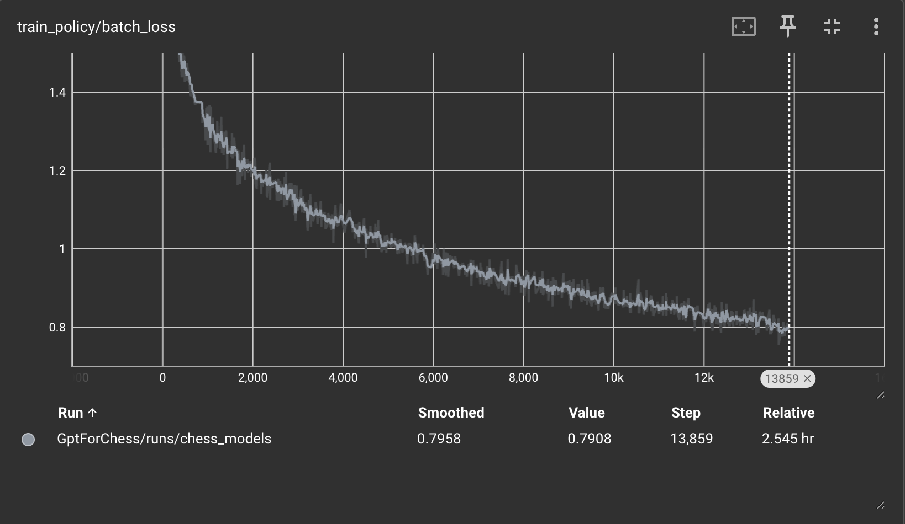
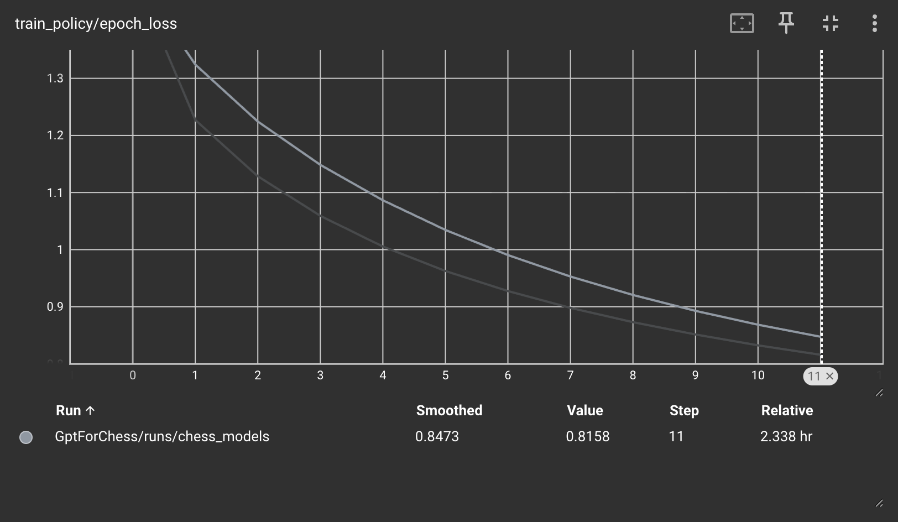
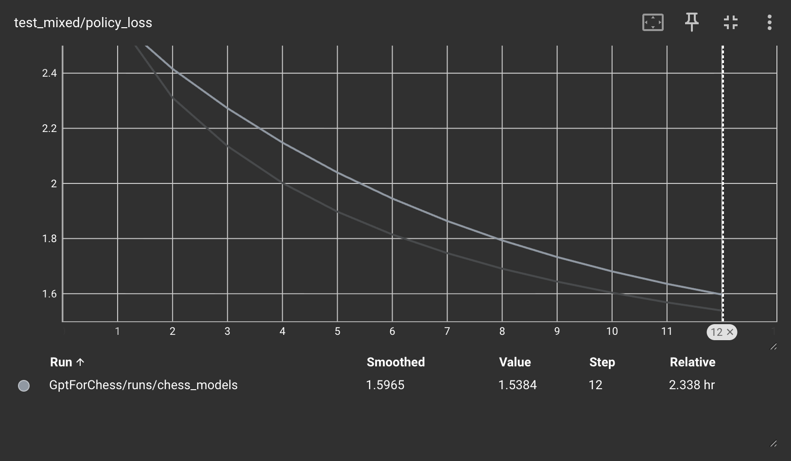
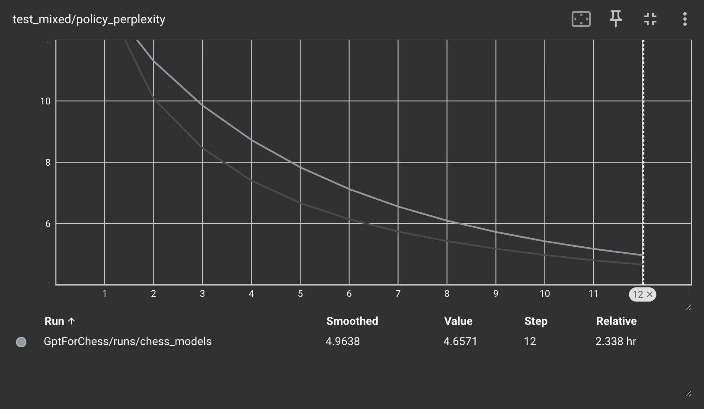
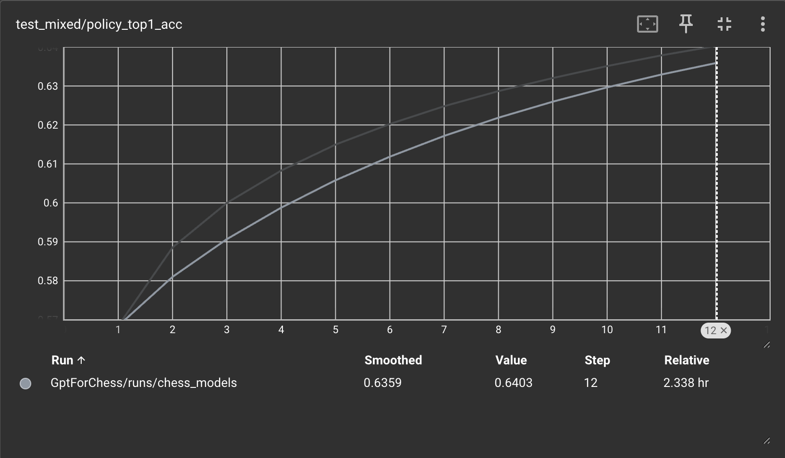
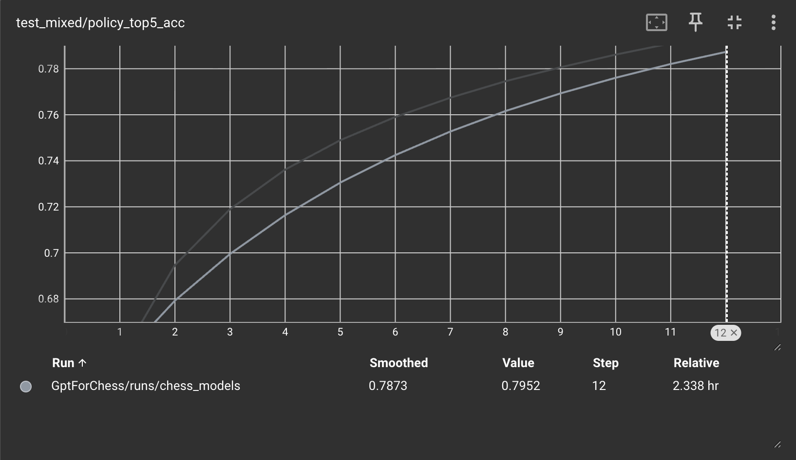
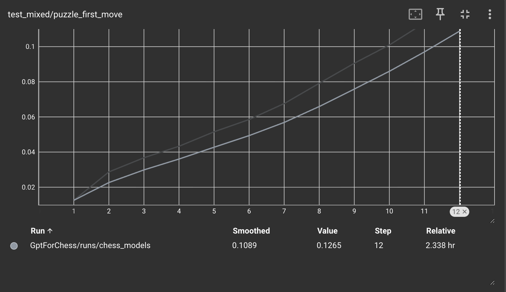
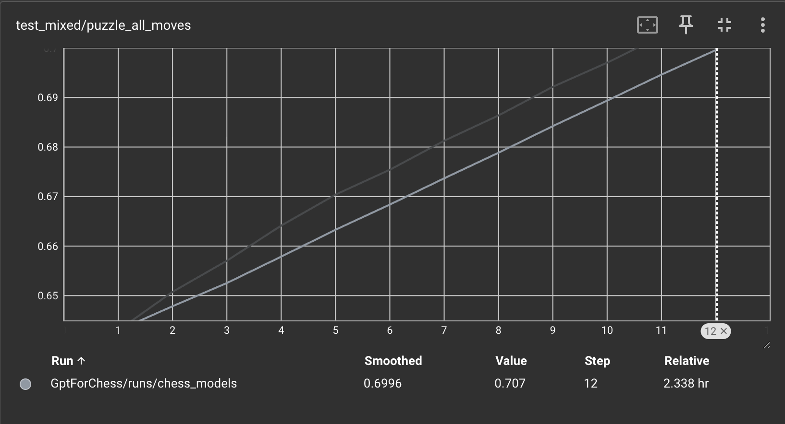
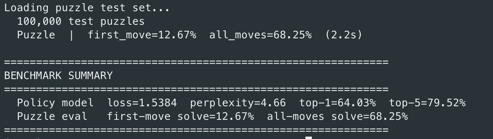

# Experiment 5: CNN Board Embedding + Mixed Game/Puzzle Training

## Hypothesis
This is more of a given but I plan on updating puzzle training to take in an encoded board state given by the FEN encoding in the puzzle data. This will dramatically improve the errors that model had with puzzle reasoning by being able to properly give attention to moves.

I will also need to udpate policy training on regular game data by having a FEN String for board state and a sequence of moves after that. It shouldn't be a problem though.

## Procedure

Set up a CNN that gets trained in unison with the encoder. The CNN takes the
19-plane board representation (`board_to_planes`) and outputs a single
context-rich `d_model` vector, which replaces the position-0 (CLS) embedding in
the move sequence. The transformer then runs over the same `(B, T, d_model)`
shape it did before — only the contents of slot 0 change.

### Architecture choice: why a single pooled board embedding (option a)

Three fusion strategies were on the table:

- **(a) Single pooled board vector** at position 0 of the move sequence.
- **(b) 64 per-square tokens** prepended to the move sequence.
- **(c) Cross-attention** with board features as keys/values and moves as queries.

Option (b) was rejected because it conflates two semantically different entities
in the same stream: each of the 64 squares becomes its own "token" the
transformer reasons about alongside the moves. The model would have to learn —
purely from positional encodings — to distinguish "this is a square" from "this
is a move." That's wasted capacity, and it inflates the sequence length from
`T` to `T + 64` (roughly 1.5x at `T=128`), making attention noticeably more
expensive for a benefit the CNN was supposed to provide in the first place.

Option (c) is architecturally the most expressive (no bottleneck, separate
streams, moves can selectively pull spatial detail), but it requires a
cross-attention layer per block and a more invasive rewrite of the encoder
stack. We're deferring it as a fallback if (a) underperforms.

Option (a) was chosen because:

1. **Separation of concerns.** Spatial reasoning lives entirely in the CNN;
   temporal/sequential reasoning lives entirely in the transformer. Each
   component does what it's good at.
2. **The sequence stays "pure."** Every position in the transformer represents
   a move (or, at position 0, the game state). No type-discrimination burden
   on the attention layers.
3. **No sequence-length inflation.** We reuse the existing CLS slot — the
   causal mask, positional encoding, padding mask, and downstream training code
   all work unchanged.
4. **Implementation cost is minimal.** A ResNet trunk with average pooling and
   a linear projection. ~1.8M params at 6 blocks × 128 channels — negligible
   next to the transformer.

### Acknowledged tradeoff

Pooling 8×8×128 = 8192 spatial features into a single `d_model`=768 vector is a
genuine information bottleneck. The CNN has to decide *up front* what's
relevant about the board, before it knows which move the policy is about to
score. If puzzle accuracy stalls in a way that suggests the model is missing
specific tactical squares (e.g., not seeing a pinned piece on a square it
hasn't "summarized" well), that is the signal to migrate to option (c).

### Implementation summary

- `BoardCNN` in `src/model.py`: stem conv → 6 residual blocks (128 channels) →
  adaptive avg pool → linear projection to `d_model`.
- `ChessPolicyModel.forward` now takes `(token_ids, board_planes, attention_mask)`.
  The board vector overwrites the position-0 embedding; the rest of the path
  (positional encoding, causal mask, encoder, prob head) is unchanged.
- `PolicyModelInference` builds planes via `board_to_planes(board)` alongside
  the existing token sequence.
- Fixed two bugs in `board_to_planes`: `board.tun` → `board.turn`, and
  `planes[12].fill(1.0)` → `planes[12].fill_(1.0)` (the non-underscore version
  is not in-place).

## Mixed training: games + puzzles in the same batches

### Why mixed instead of sequential (Phase 2a / Phase 2b)

Experiment 4 used sequential training — full-game policy first, then puzzle
fine-tuning — and observed catastrophic forgetting on regular-game play. The
new CNN-conditioned architecture makes sequential training *worse* for two
reasons:

1. **BatchNorm running-stats drift.** The original CNN sketch used
   `BatchNorm2d`. BN accumulates running mean/variance across training; if
   Phase 1 sees only game-derived board distributions and Phase 2 sees only
   puzzle distributions, the inference-time BN buffers stop matching what
   the conv filters expect. To remove this concern entirely we swapped
   `BatchNorm2d` → `GroupNorm` in `BoardCNN`, which is batch-composition
   independent.
2. **The CNN itself can forget.** In Experiment 4, the only thing that could
   "forget" was the transformer. Now the CNN's conv filters are also part of
   the learned board representation, and sequential phases would specialize
   them to one distribution then re-specialize to another.

Mixed training keeps both data sources visible throughout, eliminating the
forgetting failure mode by construction.

### Anchoring the CNN's board input

The CNN takes exactly one board planes tensor per sample (per the option (a)
design). For each data source we anchor it to the *starting* board of that
sequence:

- **Games:** `board_planes = board_to_planes(chess.Board())` — the standard
  chess starting position. The CNN signal for games is therefore a constant
  vector and provides effectively no information beyond "this is the start
  of a regular game." That's fine: games already have a rich move-history
  signal in the token sequence, and the transformer's positional encoding
  handles the temporal reasoning.
- **Puzzles:** `board_planes = board_to_planes(chess.Board(fen))` where the
  FEN is the puzzle's starting position. This is where the CNN earns its
  keep — without it, the model would have to reason about a tactical mid-game
  position from a near-empty token sequence (`[CLS]` + setup only). With it,
  the position-0 embedding carries the full board state.

Importantly, this anchor choice avoids the information-leak failure mode
discussed earlier: the CNN board never depends on a token the model is being
asked to predict, so the existing multi-position LM-style training paradigm
(loss at every non-pad position) carries over unchanged.

### Data pipeline changes

`build_datasets.py` now persists puzzle FENs alongside the token memmaps:

- `_process_puzzle` returns `(token_sequence, fen)` instead of just the
  sequence.
- `_save_policy_memmap` accepts an optional `fens` list and, when provided,
  writes `{name}_fens.bin` — `(N, fen_len)` uint8 holding zero-padded ASCII
  FEN strings.
- Stage 5 collects puzzle FENs and passes them through. `puzzle_fens.bin`
  and `puzzle_test_fens.bin` are now part of the standard build output.

`ChessPolicyDataset.from_memmap` accepts `source_tag` and `loss_weight`
arguments (defaults 0 / 1.0 for game data). When `{name}_fens.bin` exists,
the FEN at each sample index is decoded and used to build `board_planes`
via `chess.Board(fen)` → `board_to_planes(board)`. When the FEN file is
absent, the dataset falls back to the chess starting board planes (cached
once per dataset instance).

Each sample now yields `(tokens, board_planes, weight, source_tag)`, and
`collate_fn_policy` stacks the four pieces into batch-level tensors.

### Hard-balanced batches

`MixedBatchSampler` (in `train.py`) yields index lists into a
`ConcatDataset([games, puzzles])` such that every batch contains exactly
`game_ratio * batch_size` game indices and `(1 - game_ratio) * batch_size`
puzzle indices. Defaults are 80% game / 20% puzzle. Both pools are shuffled
independently; the (smaller) puzzle pool is re-shuffled whenever exhausted,
so puzzles are effectively oversampled to match the game stream.

This is preferred over stochastic mixing because:

1. The gradient signal per batch is consistent — every step "sees" puzzles.
2. BatchNorm-related composition concerns are moot (resolved by GroupNorm),
   but loss-level balance still benefits from determinism.
3. The puzzle ratio is an explicit, tunable knob rather than an emergent
   property of dataset sizes.

### Per-sample loss weighting

`_run_epoch_policy_mixed` replaces the separate `_run_epoch_policy` /
`_run_epoch_policy_puzzle` functions. The training step:

1. Builds inputs and targets (`targets = batch_tokens[:, 1:]`).
2. Masks the setup-move target for puzzle rows (`source==1`): the setup move
   is given as context, not predicted.
3. Computes per-position cross-entropy with `reduction='none'` so each
   position's loss is available before reduction.
4. Multiplies by `(position_is_valid * sample_weight)` and takes a weighted
   mean, where `sample_weight` is 1.0 for games and 5.0 for puzzles by
   default (configurable via `--puzzle-loss-weight`).

The puzzle weight is multiplicative with the batch composition — at 20%
puzzle ratio and 5× weight, puzzle positions account for ~50% of the
gradient norm per batch despite being a quarter of the samples. This is
deliberate: puzzles are the only source of high-quality tactical labels,
and the model should listen to them.

### CLI additions

- `--puzzle-loss-weight FLOAT` (default 5.0): per-sample loss weight for
  puzzle rows in the mixed training loop.
- `--puzzle-ratio FLOAT` (default 0.2): fraction of each mixed batch drawn
  from the puzzle pool.
- `--puzzle-epochs` is retained for CLI backward compatibility but ignored;
  mixed training has a single Phase 2 controlled by `--policy-epochs`.

### Rebuild required

Existing puzzle memmaps from prior runs do not contain FENs and will not
drive CNN-conditioned puzzle training correctly. Re-running
`build_datasets.py` Stage 5 produces the new `puzzle_fens.bin` /
`puzzle_test_fens.bin` files alongside the existing token/length files.
A loud warning is printed if puzzle data is loaded without the FEN sidecar.

## Results

### Headline numbers (epoch 12, held-out test)

| Metric                       | Exp 4 (Phase 2a) | Exp 4 (Phase 2b) | Exp 5 (mixed + CNN) |
|------------------------------|------------------|------------------|---------------------|
| Game policy loss             | 1.386            | 2.986            | **1.5384**          |
| Game perplexity              | ~4.0             | ~19.8            | **4.66**            |
| Game top-1 accuracy          | 65.4%            | ~9%              | **64.03%**          |
| Game top-5 accuracy          | ~78%             | —                | **79.52%**          |
| Puzzle first-move solve      | 3.6%             | 30%+ (target)    | **12.67%**          |
| Puzzle all-moves solve       | 66.9%            | 69.6%            | **68.25%**          |
| Train loss (epoch 12)        | ~1.30            | —                | **0.8473**          |
| Train / test gap             | small            | —                | **0.75 (large)**    |

### What the curves say

- **`train_policy/batch_loss`** descends cleanly from ~1.45 to **~0.79** over
  13.9K batches with no plateau or divergence — the model is still learning at
  shutdown. No sign of the lossy/oscillatory behavior that motivated this
  experiment.

  

- **`train_policy/epoch_loss`** mirrors that: a smooth 1.33 → 0.85 descent. No
  visible bend that would suggest the optimizer is saturating.

  

- **`test_mixed/policy_loss`** descends from ~2.5 to **1.60** (smoothed) — also
  monotonic and still trending down at epoch 12.

  

- **`test_mixed/policy_perplexity`** drops from ~12 to **4.96**, consistent
  with the loss curve.

  

- **`test_mixed/policy_top1_acc`** climbs to **63.6%**, top-5 to **78.7%** —
  effectively matching Exp 4 Phase 2a despite the multi-objective load.

  
  

- **`test_mixed/puzzle_first_move`** climbs roughly linearly from ~1% to
  **~12.7%**. It has *not* flattened — the trajectory suggests further epochs
  would continue to push it up.

  

- **`test_mixed/puzzle_all_moves`** climbs from ~64% to **70%**, again still
  trending up.

  

End-of-run benchmark summary:

### What worked

1. **No lossy training.** Both train and test curves descend monotonically
   across all 12 epochs (see `train_policy_batch_loss.png`,
   `train_policy_epoch_loss.png`, `test_mixed_policy_loss.png`). The
   CNN-conditioned position-0 embedding stabilized training in exactly the way
   we hoped.
2. **No catastrophic forgetting.** Game top-1 is **64.03%** vs Exp 4 Phase 2a's
   65.4% — essentially preserved (`test_mixed_policy_top1_acc.png`). Compare
   this to Exp 4 Phase 2b, which destroyed games-only performance down to
   ~9%. The "mixed batches + per-sample loss weighting" recipe successfully
   gives us puzzle gains without paying for them in game policy.
3. **Puzzle first-move solve 3.5× over Exp 4.** 12.67% vs 3.6%
   (`test_mixed_puzzle_first_move.png`). This is the single clearest signal
   that the CNN is doing what we built it to do: the model can now reason
   about an arbitrary FEN starting position rather than guessing from
   `[CLS, setup_move]` alone. The number is still well below the 30%+ target,
   but the curve is clearly mid-ascent rather than plateaued.
4. **Subjective play improved.** Consistent with the slightly higher top-5
   accuracy (`test_mixed_policy_top5acc.png`) and the puzzle gains — the
   model has more tactical signal in its move distribution even when its
   single argmax doesn't change.

### Why train loss is well below test loss (overfitting)

The 0.75-nat gap (train 0.85 vs test 1.60) is real and was absent in Exp 4
(compare `train_policy_epoch_loss.png` to `test_mixed_policy_loss.png` at
matching epochs).
Three plausible drivers, in order of likely magnitude:

1. **Puzzle oversampling.** The puzzle pool is much smaller than the game pool,
   and `MixedBatchSampler` re-shuffles puzzles whenever exhausted to maintain
   the 20% per-batch ratio. Over 12 epochs the model sees each puzzle position
   many times. The model can memorize the exact policy on each puzzle's
   training FEN — those memorized rows pull train loss down hard but do
   nothing for test loss (which uses a held-out puzzle FEN set).
2. **5× puzzle weight amplifies the memorization signal.** Each memorized
   puzzle row contributes 5× the gradient of a game row, so the optimizer is
   strongly biased toward making those rows easy. Train loss is a weighted
   average dominated by precisely the rows the model is memorizing.
3. **Added CNN capacity with constant input on games.** The CNN gets
   `board_to_planes(chess.Board())` (a constant) on game samples, so its
   capacity is *only* spent learning puzzle FEN → board vector. ~1.8M
   spatial-encoding parameters trained on the puzzle distribution alone is a
   recipe for overfitting that specific distribution.

So the gap is structural to the recipe, not a sign of a bug. It would also
plausibly *shrink* with a larger puzzle pool or a lower puzzle weight.

### Why policy loss is worse than Exp 4 Phase 2a

1.5384 vs 1.386 — about a 11% relative regression on game policy loss. Three
forces are pulling in this direction:

1. **The optimizer is solving a harder problem.** Phase 2a optimized a single
   objective: next-move log-likelihood on game continuations. Exp 5 optimizes
   a weighted sum of game continuations + tactical puzzle solutions. With
   `puzzle_ratio = 0.2` and `puzzle_loss_weight = 5.0`, puzzle positions
   contribute roughly half the gradient norm per batch. The model is partly
   spending its representational budget on tactical sharpness rather than on
   matching the modal Lichess continuation. Some game-policy degradation is
   the price of every puzzle metric that improved.
2. **The position-0 slot is no longer "free."** In Exp 4 the slot held a
   learned `[CLS]` whose representation could be tuned freely by the
   transformer for whatever made next-move prediction easiest. In Exp 5 it is
   overwritten with the CNN board vector — which on games is *constant*. The
   first token of every game sequence now provides effectively zero
   information, and the transformer can no longer use that slot as a scratch
   register. This shouldn't be huge (positions 1+ still carry the move
   history) but it removes a small affordance the Phase 2a model had.
3. **Capacity diverted to a near-useless task on games.** The CNN's job on
   game batches is to encode the standard starting board — i.e., the same
   tensor every time. Whatever gradient flows back into the CNN from
   game-batch loss is essentially gradient on a constant input, which can
   only learn an offset. That's wasted parameters and wasted optimizer state
   relative to a pure-policy run.

Mechanism (1) is intentional and is the trade we wanted. Mechanism (2) is
small. Mechanism (3) is the only one we could meaningfully fight without
giving up the puzzle gains — e.g., by skipping the CNN entirely on game
samples and using a learned `[CLS]` for those rows. Worth considering for
Experiment 6.

### Additional observations from the images

- **No epoch where test loss inflects upward** (`test_mixed_policy_loss.png`).
  The overfitting is *steady-state* rather than progressive — the gap is
  roughly constant across epochs rather than widening. That means stopping
  earlier would not have closed it, and running longer (within reason) should
  keep improving both curves in parallel. Early stopping is not the right
  lever here; the right lever is changing what gets oversampled.
- **Puzzle curves still climbing linearly at epoch 12**
  (`test_mixed_puzzle_first_move.png`, `test_mixed_puzzle_all_moves.png`).
  Both first-move and all-moves accuracy show no sign of saturation. This is
  the strongest argument for simply training longer before adjusting the
  recipe — the current ceiling has not been hit.
- **Top-5 accuracy already exceeds Exp 4** (`test_mixed_policy_top5acc.png`).
  79.52% vs ~78% suggests the model's *distribution* over plausible moves is
  slightly better than Exp 4 even though its top-1 is marginally worse.
  Combined with the qualitative "blundering less" observation, this is
  consistent with a model that is slightly less peaky but lands legal/sensible
  moves more often — exactly the signature of CNN-conditioned spatial
  reasoning bleeding into game play.
- **Smoothed vs raw values diverge by ~0.06 at the end** (visible at the
  right edge of `test_mixed_policy_loss.png`). Raw test policy loss at epoch
  12 is **1.5384** while the smoothed value is 1.5965 — the curve is still
  steepening at the cutoff. Another epoch or two would likely push raw test
  loss under 1.5.

### Recommendations for Experiment 6

1. Anchor the CNN to the live board, not the starting board, on game samples
   too — i.e., replay the move sequence and pass `board_to_planes(board_at_t)`
   for each training position. The CNN earns its keep on games as well,
   and mechanism (3) above disappears.
2. Lower `puzzle_loss_weight` (e.g., 2.0–3.0) and observe whether train/test
   gap narrows without giving back puzzle gains. The current 5× is well above
   what loss-balanced batches require.
3. Train for 20+ epochs given that neither train nor test has converged.
4. Add a held-out *game* puzzle FEN set that the model never sees during
   training to confirm the overfitting story is puzzle-specific and not a
   general-data phenomenon.