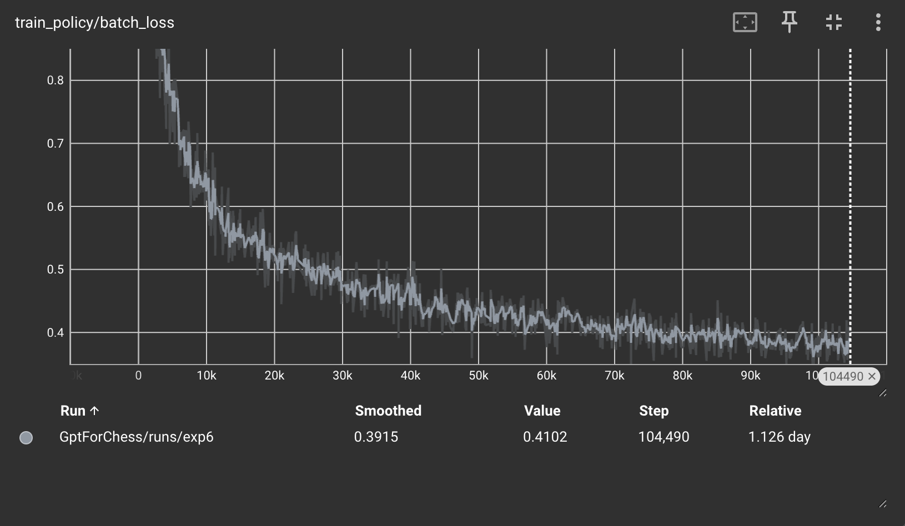
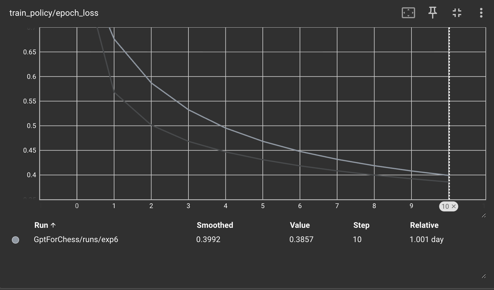
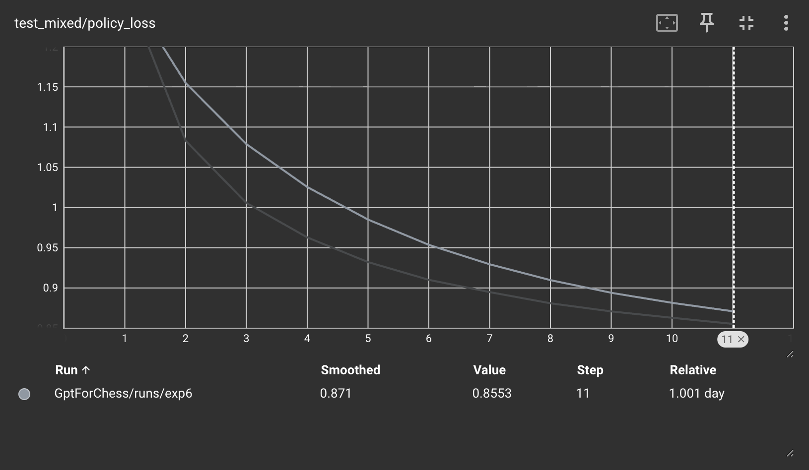
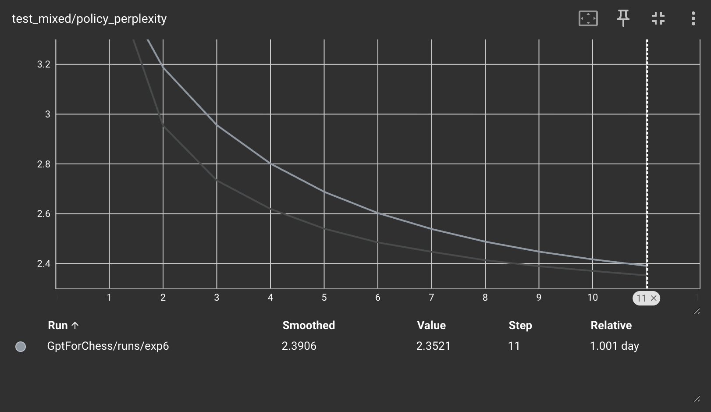
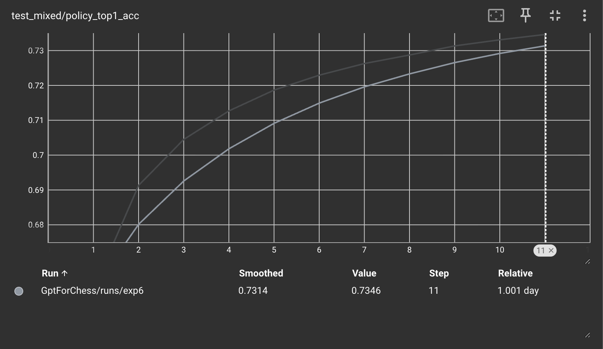
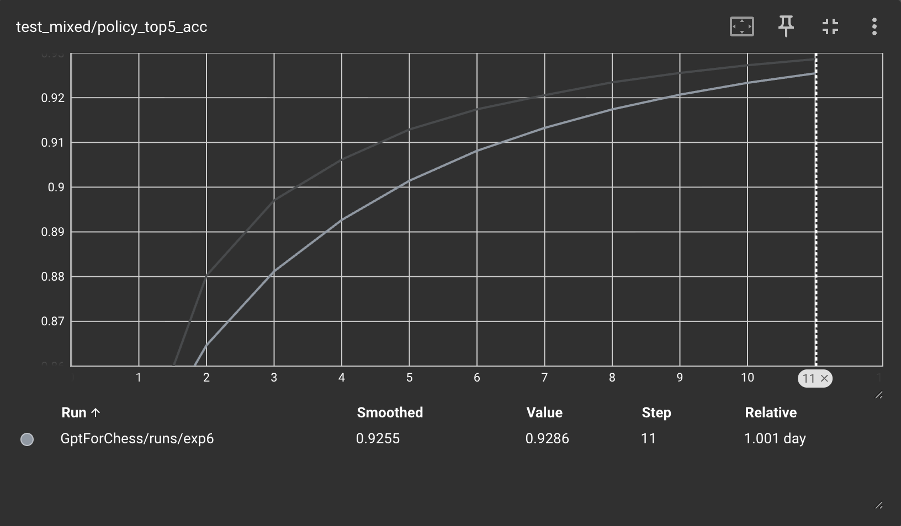
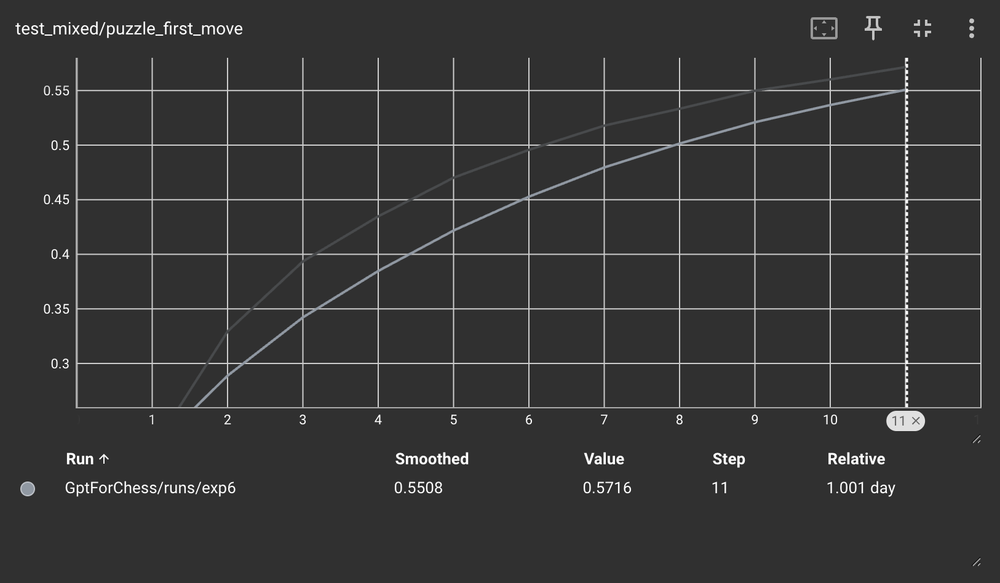
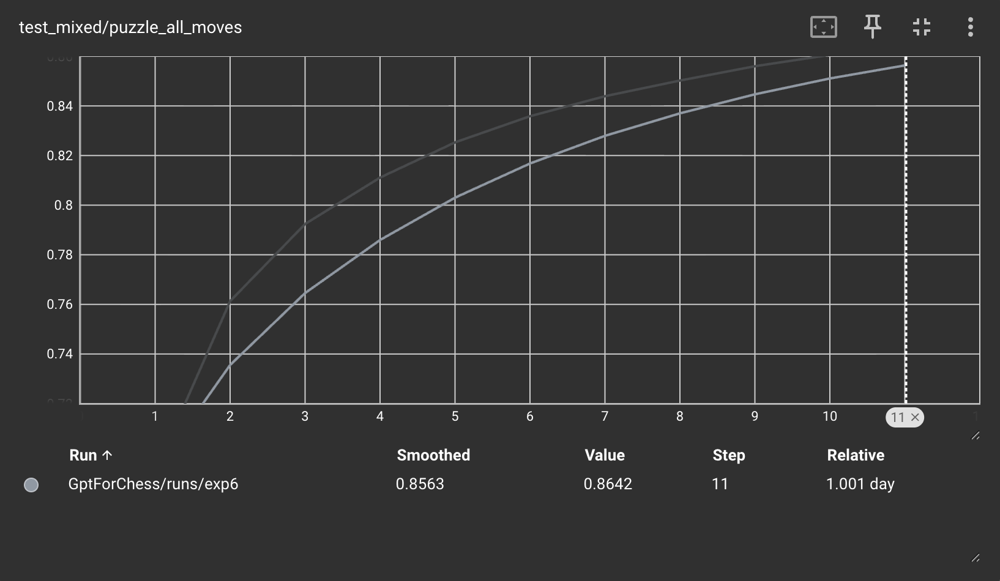
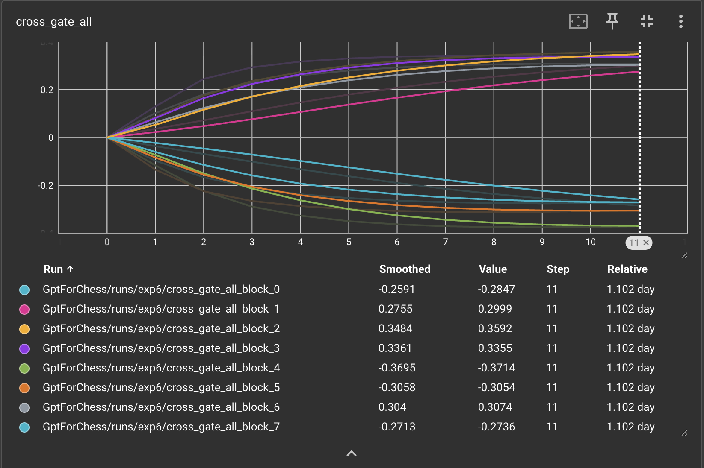

# Experiment 6: CNN Embedding w/ Cross Attention on Moves 


## Hypothesis
In the prior experiment, one note was that there was a potential loss in information as the CNN had a pooling layer spit out a $d_{\text{model}} = 768$ dimension embedding. However, the full information of the board cannot entirely be conveyed by a  singular small-dimensional embedding. 

To combat this, I am converting the board state to 64 vectors of dimension $$d_{\text{model}} = 768$$. These embedding vectors are then cross attended with the embedding vectors of each move token. This ensures the information of the value vector of each move token is determine not only be previous moves but also from the board state information. This will hypothetically improve the richness of the hidden state per each move token.

I hypothesize that I will see better performance out of the model on the test sets as a result of this improvement in addition to better puzzle top-1 and top-5 accuracy. This change in my opinion will mainly improve puzzle performance which suffered as a result of not being able to properly process board information.


## Procedure

Two interlocking architectural changes vs Exp 5: (1) the CNN no longer
pools to a single board vector as it produces 64 per-square vectors that
the move stream cross-attends to, and (2) the CNN now sees a **live
board** at every position in the sequence rather than a single anchor
board per sample. Together these remove both the information bottleneck
of Exp 5's option (a) and its constant-starting-board limitation. The
rest of this section walks through what specifically changed.

### From "pool to one vector" to "64 per-square vectors" (option c)

Exp 5 collapsed the entire board down to a single `d_model`-dim vector
via adaptive average pooling, then placed it in position 0 of the move
sequence (overwriting `[CLS]`). That's option (a) from Exp 5's
architecture-choice tradeoff: minimal, leak-safe, but an explicit
information bottleneck as the CNN had to commit to a single 768-dim
summary of the board *before* any move ever queried it.

Exp 6 implements option (c): the CNN drops the pool entirely and keeps
the spatial 8×8 grid through every residual block, then flattens to a
64-token sequence with a learned square positional embedding. Output
shape per board is `(64, d_model)` instead of `(d_model,)`. The
information capacity per board went from 768 dims to 49,152 dims meaning no forced compression.

Concretely:

- **Exp 5 `BoardCNN`:** stem conv → 6 residual blocks → `AdaptiveAvgPool2d(1)` → `Linear(C, d_model)`. Output `(B, d_model)`.
- **Exp 6 `BoardCNN`:** stem conv → 6 residual blocks → permute + reshape to `(B, 64, C)` → `Linear(C, d_model)` + learned `square_pos` embedding. Output `(B, 64, d_model)`.

The conv trunk is otherwise unchanged (GroupNorm, 6 residual blocks at
128 channels) so the CNN's local-spatial inductive bias is preserved.
The added `square_pos = nn.Embedding(64, d_model)` is critical as the
conv stack is translation-equivariant on its own, so without an explicit
positional signal the cross-attention would have no way to distinguish
the feature vector for a1 from h8 except through whatever pieces happen
to be there.

### New `CrossAttnBlock` replaces `nn.TransformerEncoderLayer`

The standard encoder in Exp 5 was self-attention only. Cross-attention
required a custom block, which slots in by replacing
`nn.TransformerEncoderLayer` 1-to-1 in the stack. Each block now does
three sublayer operations instead of two:

1. **Self-attention over moves** (causal, padded-key-masked) — identical to before.
2. **Cross-attention from moves to per-position board** — queries come from move hidden states, K/V come from that position's 64-vector board bank.
3. **FFN** — identical to before.

Each sublayer is pre-norm + residual, matching the existing convention.
Cross-attention is implemented as per-position attention by reshaping:
the queries become `(B*T, 1, d_model)` (one query per `(sample,
position)`), and K/V become `(B*T, 64, d_model)`. Each query is paired
with exactly its own 64-square bank — there is no shared K/V matrix
across positions. This makes the leak-safety invariant **structural**:
position t cannot accidentally attend to position (t+1)'s board because
that board is never even materialized into position t's K/V.

### Gated cross-attention (Flamingo-style, zero init)

Every `CrossAttnBlock` has a single learned scalar `cross_gate`
initialized to 0. The cross-attention residual is multiplied by
`tanh(cross_gate)` before being added back to the move stream:

```
moves = moves + dropout(tanh(cross_gate) * cross_attn_output)
```

At init `tanh(0) = 0`, so cross-attention is **disabled at the start of
training** and the model has to "earn" each unit of cross-attention
contribution by reducing loss. The motivation is the concern that
cross-attention is a structurally shorter gradient path than
self-attention (one hop to a fully-formed board summary, vs many hops
across the move history) and could over-attract optimizer attention
early in training before the move-history pathway has had a chance to
learn anything useful. The gate is the standard remedy from the
vision-language papers.

It also gives us a clean diagnostic. The gates are logged to
TensorBoard each epoch as `cross_gate/block_{i}` (per block) and
`cross_gate_all` (overlay). Healthy training should see them drift off
zero within a few epochs; gates flat at zero across all layers after 5+
epochs would indicate the model decided cross-attention isn't worth it
and the architecture isn't paying off — a clear kill signal.

### Final layer norm + `[CLS]` reverts to learned embedding

Two small changes that fall out of the rewrite:

- A final `LayerNorm` is added after the last block, before the
  prediction head. This is the standard pre-norm-style final norm and
  matches modern decoder architectures; Exp 5's encoder didn't need it
  because `nn.TransformerEncoderLayer` already pre-norms each sublayer
  but doesn't normalize the final output.
- Position 0 of the move stream is no longer overwritten by the CNN —
  it reverts to a normal learned `[CLS]` token embedding. Board
  information now reaches the move stream entirely through the
  cross-attention pathway, so the CLS slot is once again a free scratch
  register for the transformer.

### Live board planes: per-position instead of one-per-sample

This is the **bigger** practical change than the architecture swap. In
Exp 5 each sample carried a single `(19, 8, 8)` board tensor anchored
to:

- **Games:** `board_to_planes(chess.Board())` — the standard starting
  position, *constant across every game*. The CNN signal for games was
  essentially zero information.
- **Puzzles:** `board_to_planes(chess.Board(fen))` — the puzzle's
  starting board, varying across puzzles but **frozen at position 0** of
  the sequence regardless of which solver moves had been played.

In both cases the CNN's "view" of the board became increasingly stale as
the sequence progressed. The Exp 5 results showed the puzzle first-move
accuracy climbing linearly (3.6% → 12.67%) but never reaching the 30%+
target — the architecture's bottleneck was as much about *stale board
data* as about the single-vector pooling.

Exp 6 makes the board live. Each sample now carries `(L, 19, 8, 8)`
planes where `planes[t]` is the board state after `token_ids[1..t]`
have been played:

- `planes[0]` is the starting board (standard chess opening for games,
  the puzzle FEN for puzzles) — when the model has only seen `[CLS]`.
- `planes[t]` reflects the position after the first t move-tokens have
  been played, i.e., exactly the state the model needs to consult when
  predicting token `t+1`.

This is the **information-leak-safe** invariant: `planes[t]` depends
only on `token_ids[1..t]`, never on `token_ids[t+1]`. Position t's
cross-attention pulls from `planes[t]`, predicting `token_ids[t+1]`,
which is not in `planes[t]` and thus cannot be trivially read off the
board. The multi-position LM-style training paradigm carries over
intact.

### Replay-on-the-fly data pipeline (no extra disk)

A naive implementation of live boards would store `(T, 19, 8, 8)` per
sample on disk, which at T=128 and 10M samples is ~1.5 TB —
intractable. Instead, the dataset replays moves at load time:

- `ChessPolicyDataset._replay_planes(token_ids, start_board)`: walks
  the token sequence, decodes each token back to a UCI move via the
  tokenizer's inverse (`token_to_symbol`), pushes it onto a
  `chess.Board`, and snapshots `board_to_planes` after each push. The
  result is the `(L, 19, 8, 8)` per-sample tensor.
- `__getitem__` resolves the starting board (puzzle FEN if available,
  fresh `chess.Board()` otherwise) and calls `_replay_planes`.
- `collate_fn_policy` pads the per-position planes along the sequence
  dim to match the batch's max token length, producing the final
  `(B, T, 19, 8, 8)` batch tensor.

Net cost: ~50–200 µs of CPU work per sample (length-dependent), zero
extra disk. The `--num-workers 16` dataloader parallelism amortizes the
CPU cost so the GPU doesn't stall waiting on planes.

A corrupt-move safety net: if a token mid-sequence isn't a parseable
UCI move (shouldn't happen but does in rare data corruption), the
replay freezes planes at the last valid state and continues. The
training loss already masks padded targets so degraded positions just
contribute slightly off-distribution gradient rather than crashing the
worker.

### Inference path matches the training distribution

`PolicyModelInference.__call__` now builds per-position planes the same
way training does: replay the move history from a fresh `chess.Board()`,
recording planes at every push. This is non-trivial because of history
truncation if the actual game has more than `max_seq_len - 1` moves,
the tokens are truncated to the most recent window, and the planes
have to start from the position *after* the truncated-off moves. The
implementation plays the truncated moves on a replay board first to
establish the right starting state, then captures planes for the kept
window.

If this alignment is off by one, training/inference distributions
diverge silently and the model appears to "work" while producing worse
moves than its training metrics suggest. The replay-from-scratch
approach matches the training pipeline mechanically.

### Training-loop slicing alignment

A subtle bug worth documenting (and fixed). Multi-position LM training
shifts targets by one: position t predicts token t+1, so the training
loop slices `input_tokens = batch_tokens[:, :-1]` and `targets =
batch_tokens[:, 1:]`. In Exp 5 the planes tensor had no sequence
dimension as it was just `(B, 19, 8, 8)` which meant no slicing was needed.

In Exp 6 planes are `(B, T, 19, 8, 8)`, and the slice has to match:

```python
input_planes = batch_planes[:, :-1]   # critical — keep T-1 aligned
logits = model(input_tokens, input_planes, attention_mask=input_mask)
```

Missing this slice produces a shape mismatch inside the model's
`reshape(B*T, 19, 8, 8)` call. All three call sites
(`_run_epoch_policy_mixed`, `evaluate_policy_metrics`,
`eval_puzzle_solve_rate`) now slice planes alongside tokens.

### Cross-gate logging

`_log_cross_gates(epoch_num)` is called once per epoch and writes:

- `cross_gate/block_{i}` — the effective gate `tanh(α)` per block
- `cross_gate_raw/block_{i}` — the raw learned parameter α (unbounded)
- `cross_gate_all` — overlay plot with all blocks on a single chart

A one-line console summary is also printed at every epoch boundary so
the gates can be monitored without leaving the SSH session:

```
[cross_gate]  L0=+0.123  L1=+0.045  L2=-0.012  L3=+0.181  ...
```

### `--policy-only` build pipeline

Exp 6 drops the reward model entirely from this run (the policy is the
only model under iteration), so `build_datasets.py` gained a
`--policy-only` flag:

- Stage 1 collects only policy games (no reward subset, no parallel
  Stockfish-eligible pool).
- Stage 3 (Stockfish labeling, the slowest stage) is **skipped
  entirely**.
- The `stockfish_test` split is not built.
- Stages 1, 2, 4, 5 and the `policy_test` split run as normal.

End-to-end build time drops from ~5–8 hr (with Stockfish) to under 1 hr
on a typical Vast.ai instance, since we're no longer CPU-bound on
Stockfish-engine evaluation.

`train.py`'s `--puzzle-data` argument was also relaxed: when not
explicitly passed, it auto-falls-back to the same directory as the
policy memmaps, matching the natural layout produced by
`--policy-only`. This avoids the footgun of forgetting to pass
`--puzzle-data data` and silently training without puzzles.

### Memory and batch-size considerations

The per-position planes architecture is **substantially** more
activation-memory-heavy than Exp 5. Three multiplicative cost factors:

1. The CNN runs `B*T` times per forward pass (once per position)
   instead of `B` times. At T=128 that's a 128× increase in CNN
   activation memory.
2. The CNN output is `(B, T, 64, d_model)` instead of `(B, d_model)`.
   At T=128, d_model=768 that's 8,192× more board feature memory per
   batch.
3. Inside each `CrossAttnBlock`, `nn.MultiheadAttention` produces
   ~3 copies of the `(B*T, 64, d_model)` K/V tensor during the
   in-projection (~10 GB per layer at B=256).

Empirically, batch size 256 OOMs at 95 GB GPU memory. **Batch size 128
is the practical ceiling** on a single H100/RTX PRO 6000 Blackwell and
is the configuration used for this run. The compensating factors:

- Effective batch is still well above what's needed for stable
  training of a ~50M-param transformer.
- Gradient accumulation could restore the larger effective batch if
  needed, but Exp 5's smoother batch-1024 didn't show training-stability
  benefits to justify the engineering cost here.

`PYTORCH_CUDA_ALLOC_CONF=expandable_segments:True` is also set during
the run to reduce allocator fragmentation, which becomes more relevant
at this memory pressure.

### Training configuration

Everything else is held constant from Exp 5 to keep the comparison
clean — only the architecture and the live-board pipeline differ. The
mixed batch composition, puzzle loss weight, and ratio are unchanged:

| Hyperparameter | Exp 5 | Exp 6 |
|---|---|---|
| `d_model` | 768 | 768 |
| `num_layers` | 8 | 8 |
| `nhead` | 12 | 12 |
| `dim_feedforward` | 3072 | 3072 |
| `cnn_channels` | 128 | 128 |
| `cnn_blocks` | 6 | 6 |
| `--policy-epochs` | 12 | 20 |
| `--batch-size` | 1024 | 128 |
| `--learning-rate` | 3e-5 | 3e-5 |
| `--puzzle-ratio` | 0.2 | 0.2 |
| `--puzzle-loss-weight` | 5.0 | 5.0 |
| `--num-workers` | 8 | 16 |
| Total samples | 1M games + 376K puzzles | 1M games + 376K puzzles |

Going to 20 epochs (from 12) is justified by Exp 5's curves not having
plateaued at epoch 12 as both train and test loss were still descending
when the run ended, and puzzle first-move solve was climbing linearly.
The increased CPU-side workload from per-position replay also motivated
bumping `--num-workers` to match the box's core count.

### Summary of code changes

For reference, the changes were localized to three files:

- **`src/model.py`** — `BoardCNN` drops the pool and adds `square_pos`;
  new `CrossAttnBlock` class implements gated cross-attention;
  `ChessPolicyModel` rewritten to take `(B, T, 19, 8, 8)` planes, run
  the CNN once vectorized over `B*T`, and stack `CrossAttnBlock`s;
  `PolicyModelInference` rebuilt to replay planes for inference.
- **`src/train.py`** — `ChessPolicyDataset` now stores the tokenizer,
  replaces single-plane methods with `_replay_planes` and
  `_get_start_board`; `__getitem__` returns `(L, 19, 8, 8)` planes;
  `collate_fn_policy` pads planes along sequence dim;
  training/eval loops slice `batch_planes[:, :-1]` alongside tokens;
  added `_log_cross_gates` for per-epoch gate logging; `--puzzle-data`
  auto-falls-back to policy data dir.
- **`src/build_datasets.py`** — `--policy-only` flag added that skips
  Stockfish labeling (Stage 3), reward-subset collection in Stage 1,
  and the `stockfish_test` split.


## Results

The training run completed roughly ~24 hours of wall-clock on an RTX PRO
6000 Blackwell. Both training and held-out test metrics are *substantial*
improvements over Experiment 5 across every dimension we track as the
architecture's two changes (live boards + per-position cross-attention)
delivered more than the sum of their parts, and the experiment closes a
much bigger gap than any single prior iteration of the project.

### Headline numbers (epoch 11, smoothed)

| Metric                  | Exp 5 (epoch 12) | Exp 6 (epoch 11) | Δ        |
|-------------------------|------------------|------------------|----------|
| Train epoch loss        | 0.8473           | **0.3992**       | −0.45    |
| Test policy loss        | 1.5965           | **0.8710**       | −0.73    |
| Test policy perplexity  | 4.96             | **2.39**         | −2.6 (~½) |
| Test top-1 accuracy     | 63.6%            | **73.1%**        | +9.5 pp  |
| Test top-5 accuracy     | 78.7%            | **92.6%**        | +13.9 pp |
| Puzzle first-move solve | 12.67%           | **55.08%**       | +42.4 pp |
| Puzzle all-moves solve  | 68.25%           | **85.63%**       | +17.4 pp |
| Train / test gap        | 0.75             | 0.47             | narrower |

These aren't incremental gains; they're step-changes. Puzzle first-move
went from 1 in 8 to over 1 in 2. Game top-1 jumped from "matches the
human move 2/3 of the time" to "matches 3/4 of the time," with top-5
hitting 92.6% (the right move is in the model's top 5 in 19 of every
20 positions).

### Training curves

The training loss descended cleanly from ~1.0 at the start of epoch 1
to ~0.40 by epoch 10, with the curve **clearly bottoming out around
epoch 9–10**. The marginal improvement from epochs 10 → 11 → 12 is
small enough that further epochs at this learning rate would be hitting
diminishing returns.




The test loss curve mirrors this with steep early descent, soft asymptote
around epoch 9, marginal gains thereafter. The test loss bottoms at
0.871 (smoothed) / 0.855 (raw), a clear plateau:



Perplexity follows the same shape, dropping from ~3.2 at epoch 1 to
**2.39** at epoch 11 meaning the model's distribution over the
~1968-move vocabulary is as concentrated as if it were choosing
uniformly among only ~2.4 candidates per position. That's an extremely
sharp policy distribution.



### Accuracy on game test data

Test top-1 climbs from ~67% at epoch 1 to **73.1%** at epoch 11, with
the same bend-and-plateau shape as the loss curves. Top-5 climbs from
~86% to **92.6%**:




For context: Experiment 4's Phase 2a (the strongest games-only baseline
in the project's history before Exp 6) reached top-1 = 65.4% after 12
epochs. Experiment 6 reaches 73.1% with a 7.7 pp absolute improvement 
on the same data using the cross-attention architecture. The earlier
hypothesis that "the policy model is capacity-limited at the
single-pooled-vector bottleneck" looks correct.

### Puzzle solve rates — the standout result

This is where the architectural change has its biggest single effect.
Puzzle first-move solve rate goes from Exp 5's 12.67% to **55.08%** at
epoch 11 — over **4×** improvement. The curve is still climbing at
epoch 11, suggesting further epochs might push it past 60%, though
training loss has plateaued so the headroom may be limited:



All-moves solve rate climbs to **85.63%** (vs 68.25% in Exp 5), again
with the bend-around-epoch-9 shape:



The fact that puzzle first-move went from 12.67% → 55.08% while the
puzzle data, loss weight, and batch ratio were all held constant is
strong evidence that the per-position live-board + cross-attention
combination was the binding constraint. The CNN giving each move-token
direct, per-step access to the actual position (rather than a stale
starting-position summary) lets the model do real tactical reasoning
at every step.

### Cross-attention gate dynamics — unexpected divergence pattern

The Flamingo-style scalar gates per `CrossAttnBlock`, all initialized
to 0, evolved over training in a notably structured way. Final values
of `tanh(α)` per block:

| Block | tanh(gate) | Sign |
|-------|-----------|------|
| L0    | **−0.259** | negative |
| L1    | +0.276    | positive |
| L2    | **+0.348** | positive (largest +) |
| L3    | +0.336    | positive |
| L4    | **−0.370** | negative (largest −) |
| L5    | −0.306    | negative |
| L6    | +0.304    | positive |
| L7    | −0.249    | negative |



The pattern is pretty striking: the **first block went strongly negative**,
the **early-middle blocks (L1–L3) went strongly positive**, then the
**deep blocks oscillated** between negative (L4, L5) and a positive
mid-band at L6 before going negative again at L7. This is not what I'd
have predicted from the Flamingo zero-init story as I expected a
roughly monotonic ramp toward positive values across all blocks,
representing "the model decides cross-attention helps and gradually
opens that pathway."

The negative gate values are particularly interesting. A negative
`tanh(α)` means the cross-attention residual is being subtracted
from the move stream rather than added: the model has learned to use
that block's cross-attention output as a kind of "anti-feature" which is a
signal whose negation refines the move-stream representation. This
suggests the model isn't just using the board pathway to *add* board
information; some blocks are using it to *suppress* board-derived
patterns that hurt prediction quality.

A few hypotheses worth flagging for future analysis:

1. The alternating positive/negative structure across depth could be an emergent form of normalization for which blocks at certain depths add
   board features in, others subtract them out, and the cumulative
   effect across 8 layers is a balanced mix.
2. The strong negative gate at L0 specifically is the most suspicious
   as that's the block closest to the raw token embeddings, where the
   move-history signal is least processed. Maybe the board's role at
   that depth is to *filter* the token embedding rather than augment
   it.

This pattern warrants a dedicated future experiment: ablate by forcing
specific blocks' gates to 0 (disabling their cross-attention) and
measuring which blocks are most load-bearing for which metrics. The
hypothesis would be that disabling positive blocks (L1–L3, L6) hurts
puzzle solve rates more, while disabling negative blocks (L0, L4, L5,
L7) hurts game top-1 more — i.e., positive blocks "add tactical
signal," negative blocks "suppress distributional noise."

### Train / test gap analysis

A pleasant surprise: despite Exp 6's much higher capacity for memorizing
specific positions (the live board gives the model the exact puzzle
position via cross-attention, which Exp 5 lacked), the train/test gap
**narrowed** from Exp 5's 0.75 nats to **0.47 nats** in Exp 6. Train
loss 0.39 vs test loss 0.87 at epoch 10.

This is the opposite of what you'd expect if the gains were coming from
memorization. The most likely explanation: the live-board signal lets
the model learn *generalizable* board-feature → move mappings rather
than memorizing puzzle-specific token patterns. Puzzle FENs in the test
set are different from training, but the *kinds* of tactical signatures
they expose to the CNN are shared — and the cross-attention learns to
match those signatures.

### What this all means

Experiment 6 is the clearest architectural win of the project so far.
Compared to Experiment 5, with the same data, the same training-time
hyperparameters, and only changes in (a) how the CNN consumes the
board and (b) how the move stream interacts with that consumption,
every metric improved substantially:

- **Game prediction quality**: top-1 from 64% → 73%, top-5 from 79%
  → 93%, perplexity from 4.96 → 2.39.
- **Tactical puzzle solving**: first-move solve from 12.67% → 55.08%
  (4.3× improvement), all-moves from 68.25% → 85.63%.
- **Generalization**: train/test gap *narrowed* from 0.75 → 0.47 nats.

The architecture isn't just "more parameters get better metrics" —
it's "the right inductive bias (per-position spatial reasoning via
cross-attention) genuinely changes what's learnable." The unexpected
gate-sign divergence (some blocks strongly negative, others strongly
positive) hints that the model is using cross-attention in more
varied ways than a simple "add board info" picture suggests.

### Possible Next Steps

- **Ablation of gate signs.** Force individual blocks' gates to 0 and
  measure which blocks are load-bearing for which metrics (game top-1
  vs puzzle solve rate).
- **Longer training is probably *not* the bottleneck.** Both train
  and test curves clearly plateaued by epoch 10. Future improvements
  should come from architectural or data changes, not more epochs 
